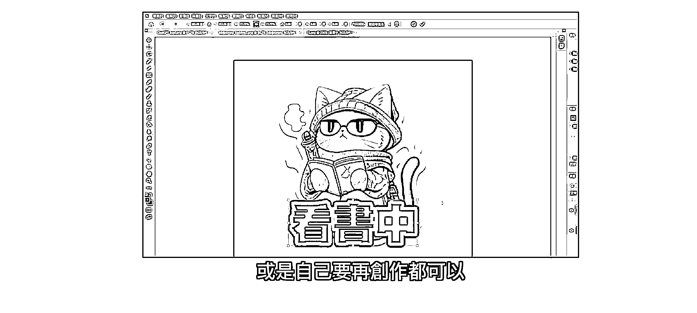
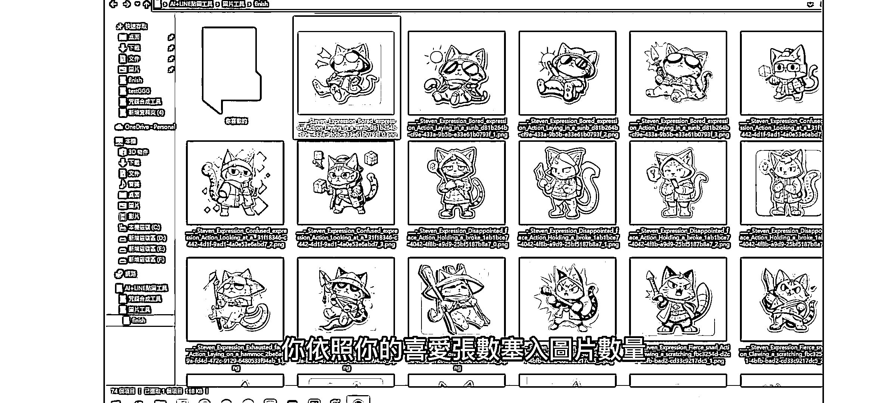
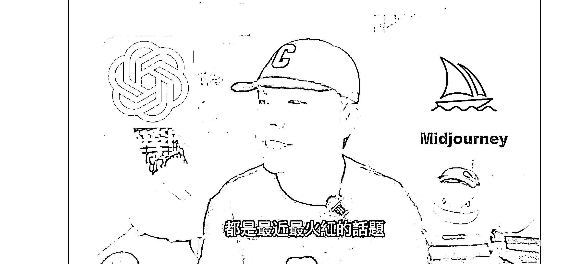

# AI 绘画 MJ + ChatGPT + line 贴图 ，利用表情包变现

> 原文：[`www.yuque.com/for_lazy/xkrm14/vtxk0clwfy1lscso`](https://www.yuque.com/for_lazy/xkrm14/vtxk0clwfy1lscso)

作者： 乐希

日期：2023-03-15

点赞数：43

正文：

ai 绘画 mj+ChatGPT+line 贴图=表情包变现 mj 用来做 line 贴图，可以直接销售。 提示词也用 ChatGPT 生成 已经有人几天直接变现了一万多日元 上架后就是躺赚，比百度文库好多了 NFT 也一样，ai 绘画非常适合发散性的内容制作 用来做微信表情包，也可以引流

评论区：

竹影 : 想请教下，mj 注册需要注意什么，我一直注册不成功[抱拳][抱拳]

乐希 : 可以直接加入 discord 小组去做的，注册不成功是什么原因呢

竹影 : 怎么加入 discord 小组[抱拳]

乐希 : 官网上有链接的，另外可以在小航海的 ai 绘画手册里看到 mj 的详细注册方式，如果不太懂可以在 b 站看手把手教程

竹影 : 好的，谢谢拉

赈早见海 : 10000 日元才 500RMB，看来不怎么赚😂而且要对 Line 文化比较了解，适合 tw 本地人做吧

乐希 : 虽然暴利不了，这个产业是细水长流的，就一套表情包，几天就销售 600，这些都是 gpt 生成的提示词，批量投喂就行了，要是专门去做，一天生产 5 套，之后躺赚过万也不是不行。 主要是专业的别人花一个月的事情，自己半天就能搞定，能赚钱的都可以这么做，比如文库，头条，投稿，都是搬砖生意，但效率提高很多。

