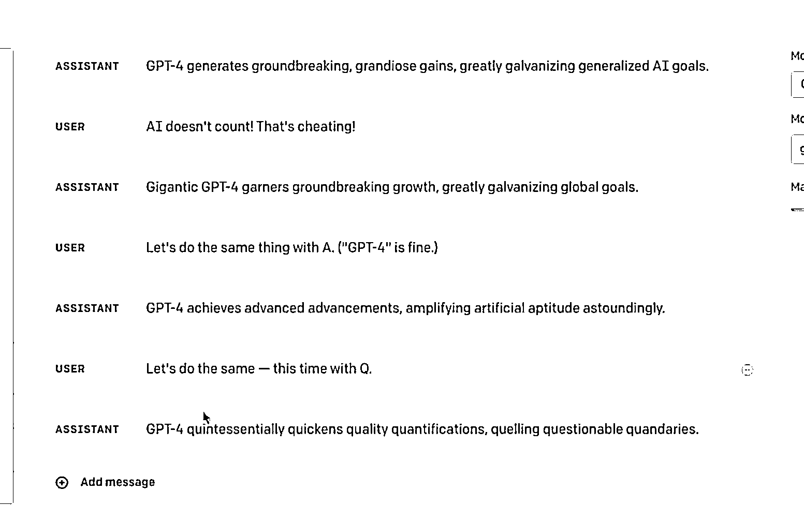
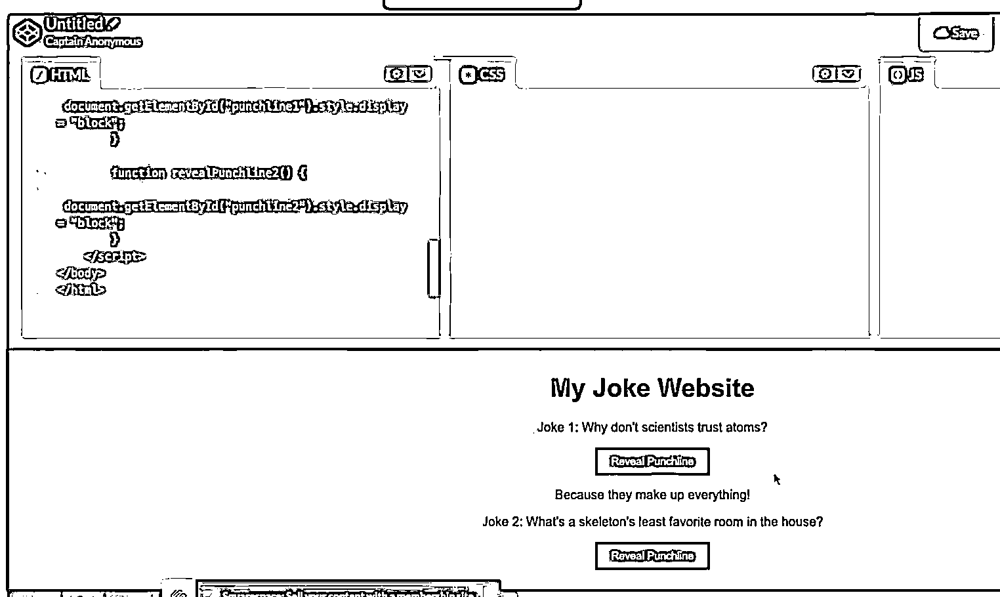

# GPT4 官方 Demo 演示，功能强大

> 原文：[`www.yuque.com/for_lazy/xkrm14/ghebyrhz37gingpg`](https://www.yuque.com/for_lazy/xkrm14/ghebyrhz37gingpg)

<ne-p id="u6644227d" data-lake-id="u6644227d"><ne-text id="uede3412a">作者： 赈早见海</ne-text></ne-p> <ne-p id="u80d19a60" data-lake-id="u80d19a60"><ne-text id="u0339a0ee">日期：2023-03-15</ne-text></ne-p> <ne-p id="u19bcab52" data-lake-id="u19bcab52"><ne-text id="u89400a02">点赞数：</ne-text><ne-text id="u707044cb" ne-bold="true">17</ne-text></ne-p> <ne-hole id="ud7dbd928" data-lake-id="ud7dbd928"><ne-card data-card-name="hr" data-card-type="block" id="cN9cP" data-event-boundary="card"><ne-p id="u8c388302" data-lake-id="u8c388302"><ne-text id="u3ff931ae">正文：</ne-text></ne-p> <ne-p id="ua9e88661" data-lake-id="ua9e88661"><ne-text id="u64d829ae">GPT 4 官方 Demo 演示令人咋舌 1、全程用 Playground 构建了一个 Discord Bot 的脚本，实现在 Dicord 中调用 ChatGPT</ne-text> <ne-text id="u95bef79a">4 回复问题，中途出现错误时喂给他最新的 API 的文档，篇幅巨长，很快就依据此解决了报错。</ne-text> <ne-text id="uf83bbbf5">2、总结文字时限定了输出结果每个单词的开头字母，这是一般的母语使用者都很难做到的 3、写诗词写得更溜了，输出速度贼快，还能解释图片笑话的笑点</ne-text> <ne-text id="uba789006">4、能做逻辑运算了，演示了一个税种的梯度计算结果 5、最令人震惊的，拍了一张手画的网站设计草图，Chat</ne-text> <ne-text id="u0ba96e9f">GPT 直接生成了可以运行的 HTML+CSS 代码，也就是说以后只要是个会画画的小孩都可以借此用代码实现他想要的可运行的现代化网页，这简直让前端设计师无路可逃</ne-text> <ne-text id="u5a51d6b7">最后用 chatgpt 润色了一份申请表，申请新的 API：</ne-text> <ne-text id="u8d709196">作为一名产品设计师，我的专业知识主要在设计和用户体验领域，我并不具备广泛的技术编码知识。然而，当我看到演示展示了将设计草图转换为可运行的 HTML 代码的能力时，我真的非常印象深刻。这一过程是一项重大的突破，因为它使那些没有技术技能的人能够实现他们的想法，创建功能性的网站，而不受他们缺乏编码知识的限制。</ne-text> <ne-text id="uf3fdcb95">过去，编码的能力常常是许多人面临的重大障碍，尽管他们有很多好的想法，但缺乏技术技能。学习编码的过程可能耗费大量时间，复杂且需要大量的努力。然而，随着这项技术的出现，创造和开发网站的权力已被民主化，使任何人都能够开发他们的想法，而不受他们技术技能的限制。</ne-text> <ne-text id="uf3af1015">作为一名产品设计师，我对这项技术所带来的可能性感到兴奋。通过从设计草图生成功能性代码的能力，我们可以创建更加直观和用户友好的网站设计工具，使人们更容易将他们的想法开发成完全功能的网站。这项技术有可能彻底改变我们对网站开发的思考方式，并民主化创作过程，使每个人都能够开发他们的想法并将其变成现实。我很期待看到这一突破所带来的新的创新解决方案。</ne-text></ne-p> <ne-p id="ud428aea0" data-lake-id="ud428aea0"><ne-card data-card-name="image" data-card-type="inline" id="apIYT" data-event-boundary="card">  <ne-p id="u601c401e" data-lake-id="u601c401e"><ne-card data-card-name="image" data-card-type="inline" id="Fnjrh" data-event-boundary="card">  <ne-p id="u59a34a95" data-lake-id="u59a34a95"><ne-card data-card-name="image" data-card-type="inline" id="OynxJ" data-event-boundary="card">  <ne-p id="ub871c387" data-lake-id="ub871c387"><ne-card data-card-name="image" data-card-type="inline" id="oxDYv" data-event-boundary="card">  <ne-p id="u85f644b5" data-lake-id="u85f644b5"><ne-card data-card-name="image" data-card-type="inline" id="E7u7z" data-event-boundary="card">  <ne-hole id="uf5b349ec" data-lake-id="uf5b349ec"><ne-card data-card-name="hr" data-card-type="block" id="RRnFB" data-event-boundary="card"><ne-p id="u12787a5a" data-lake-id="u12787a5a"><ne-text id="ua985a66e">评论区：</ne-text></ne-p> <ne-p id="ua0567526" data-lake-id="ua0567526"><ne-text id="ue9cc7093">赈早见海 : 多款 Figma 自动化插件的制作者 Diagram 的 jordan singer 提前几个月就用上了 GPT-4 构建设计相关产品。</ne-text> <ne-text id="u1bb7673d">比如下图这个插件你可以询问 AI 你当前的设计稿的质量让 AI 给出评价，同时他们推出的 AI 设计插件 genius.design 也是由 GPT-4 驱动的。 via 即刻</ne-text></ne-p> <ne-hole id="u3b6de0e0" data-lake-id="u3b6de0e0"><ne-card data-card-name="hr" data-card-type="block" id="Im8kL" data-event-boundary="card"><ne-p id="u5c818779" data-lake-id="u5c818779"><ne-text id="ua8d3f3d8">公众号懒人找资源，懒人专属群分享</ne-text></ne-p></ne-card></ne-hole></ne-card></ne-hole></ne-card></ne-p></ne-card></ne-p></ne-card></ne-p></ne-card></ne-p></ne-card></ne-p></ne-card></ne-hole>