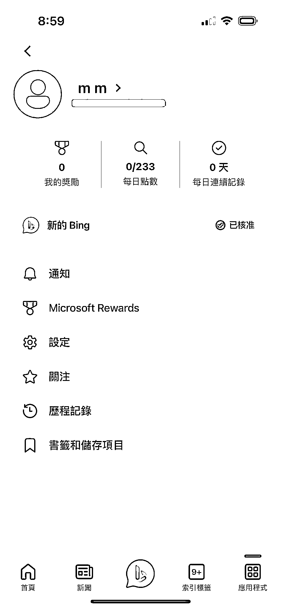

# 信息差 实测 new bing 新注册秒通过

> 原文：[`www.yuque.com/for_lazy/xkrm14/hxg5tfgiv746y3g3`](https://www.yuque.com/for_lazy/xkrm14/hxg5tfgiv746y3g3)

作者： 常常

日期：2023-03-15

点赞数：29

<ne-card data-card-name="hr" data-card-type="block" id="LNFYy" data-event-boundary="card">

正文：

一个信息差 实测 new bing 新注册秒通过… 要点： - 日本全局代理 - 使用手机版 new bing （美国区下载） - 使用 Gmail，在用户名里加个.代表新邮箱。比如 oran.ge@gmail.com - 登录 new bing app，登录告诉你没注册，点击注册用上面的邮箱注册

<ne-card data-card-name="image" data-card-type="inline" id="jxdnE" data-event-boundary="card">  <ne-card data-card-name="hr" data-card-type="block" id="gVndg" data-event-boundary="card"><ne-p id="ud8af3886" data-lake-id="ud8af3886">评论区：

假行僧 : 还不睡觉，太卷了

公子李 : 第 3 点，用国内老账号比如@qq.com，登录可以吗

冰莹 : 我用 qq 邮箱注册收不到验证码，gmail 邮箱一秒收到

常常 : [偷笑]

超级奶爸 Rock : 奇怪 了 使用 APP 注册 用不了 Gmail 用网页注册又卡在验证机器人🤖

超级奶爸 Rock : APP 里面新建账号就这到这里😂

一诚 : 那个邮箱后缀可以点击选择成 gmail 的

<ne-card data-card-name="hr" data-card-type="block" id="C6LLH" data-event-boundary="card">

公众号懒人找资源，懒人专属群分享

</ne-card></ne-card></ne-card></ne-p></ne-card>