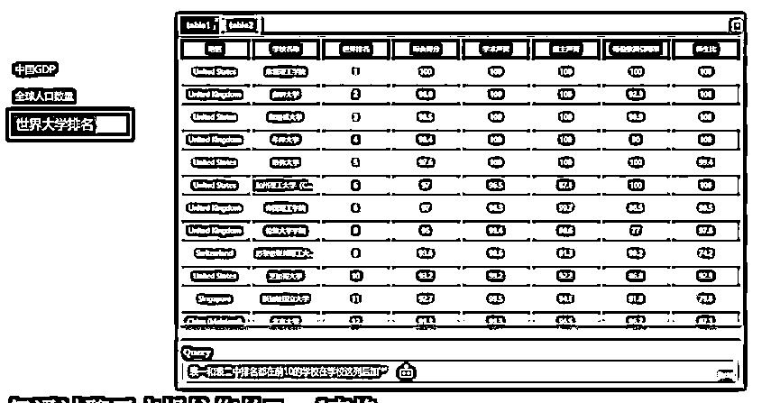

# ChatExcel AI 工具，按需求自动处理表格

> 原文：[`www.yuque.com/for_lazy/xkrm14/ct6gy1r97pip18an`](https://www.yuque.com/for_lazy/xkrm14/ct6gy1r97pip18an)

<ne-p id="ub3489aff" data-lake-id="ub3489aff"><ne-text id="udd81936f">作者： 七哥个人品牌</ne-text></ne-p> <ne-p id="ub08afe7c" data-lake-id="ub08afe7c"><ne-text id="u5a90e7fb">日期：2023-03-14</ne-text></ne-p> <ne-p id="uab49270e" data-lake-id="uab49270e"><ne-text id="u7b43381b">点赞数：</ne-text><ne-text id="u648f2dc8" ne-bold="true">36</ne-text></ne-p> <ne-hole id="u0355fb3d" data-lake-id="u0355fb3d"><ne-card data-card-name="hr" data-card-type="block" id="EZRjI" data-event-boundary="card"><ne-p id="u0be1167e" data-lake-id="u0be1167e"><ne-text id="u2a579bce">正文：</ne-text></ne-p> <ne-p id="uc251b3c2" data-lake-id="uc251b3c2"><ne-text id="ubfef6da8">43 💊类型：工具类 💊情况 现在 AI 项目火热，北大团队也跟着做了这个 ChatExcel AI 工具 在聊天框内输入对于表格的整理需求表格就会自动处理</ne-text> <ne-text id="ucb21ae2c">似乎是在真正的实现“办公自动化”的路上又前进了一步！ 目前还是测试版，免费无限制使用，大家可以测试一下！ 💊地址：酷表 ChatExcel：</ne-text> <ne-text id="u74d433dd">43</ne-text>[<ne-text id="ucdffcf11">酷表 ChatExcel</ne-text>](https://chatexcel.com)</ne-p> <ne-p id="ud617a779" data-lake-id="ud617a779"><ne-card data-card-name="image" data-card-type="inline" id="FCqwW" data-event-boundary="card">  <ne-hole id="udecdd748" data-lake-id="udecdd748"><ne-card data-card-name="hr" data-card-type="block" id="bk9ze" data-event-boundary="card"><ne-p id="ua4474cc3" data-lake-id="ua4474cc3"><ne-text id="ua21d2152">评论区：</ne-text></ne-p> <ne-p id="u1f3654c5" data-lake-id="u1f3654c5"><ne-text id="u02bc5b3f">暂无评论</ne-text></ne-p> <ne-hole id="uc0a4fcb0" data-lake-id="uc0a4fcb0"><ne-card data-card-name="hr" data-card-type="block" id="qvx8t" data-event-boundary="card"><ne-p id="u1f7bc686" data-lake-id="u1f7bc686"><ne-text id="u2e455fba">公众号懒人找资源，懒人专属群分享</ne-text></ne-p></ne-card></ne-hole></ne-card></ne-hole></ne-card></ne-p></ne-card></ne-hole>