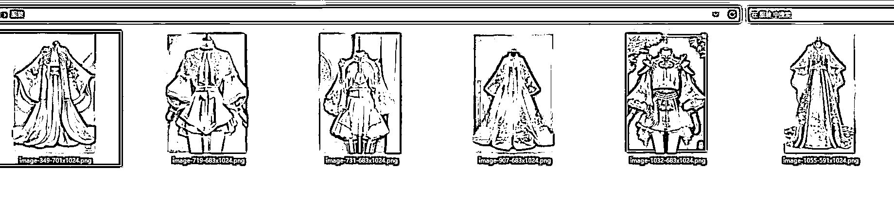
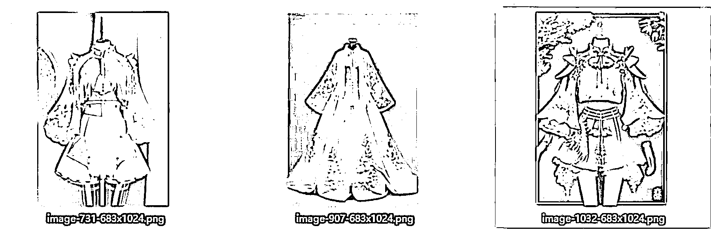
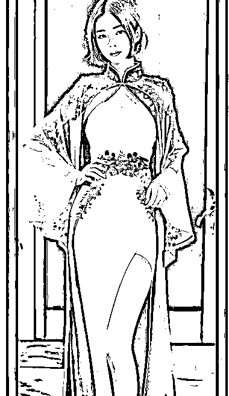
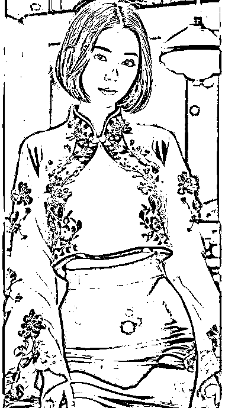

# AI 绘图+Lora=女装模特，成本低

> 原文：[`www.yuque.com/for_lazy/xkrm14/gre0k1xxsn17puuh`](https://www.yuque.com/for_lazy/xkrm14/gre0k1xxsn17puuh)

作者： 乐希

日期：2023-03-14

点赞数：37

正文：

AI 绘图+Lora=女装模特 b 站上看到有人做女装的，找人接单用 ai 来做模特 用 lora 模型，效果居然很不错，但是目前有差异，应该有方法能产生一样的服装。 反向来看: 做女装设计的可以用一个元素去产生无数种风格的衣服。 也可以先放开预售，有人卖再制作，定制。 ai 模特身上的衣服不一定真实存在，批量上架，价格高点，N 人成团。 未来成本高昂的淘宝模特也不需要了 用在 cos 服装，汉服 lolita 等，亚文化可以卖高价 亚文化的服装公司估计已经开始行动了

  <ne-p id="u87aa847c" data-lake-id="u87aa847c">  <ne-p id="u790d522b" data-lake-id="u790d522b">  <ne-p id="u792c2c64" data-lake-id="u792c2c64">  <ne-p id="uce973f7f" data-lake-id="uce973f7f">  <ne-p id="u7a8ec992" data-lake-id="u7a8ec992">  <ne-p id="u7564d6bc" data-lake-id="u7564d6bc">评论区：

大宝~ : 好方法

公众号懒人找资源，懒人专属群分享

</ne-p></ne-p></ne-p></ne-p></ne-p></ne-p>