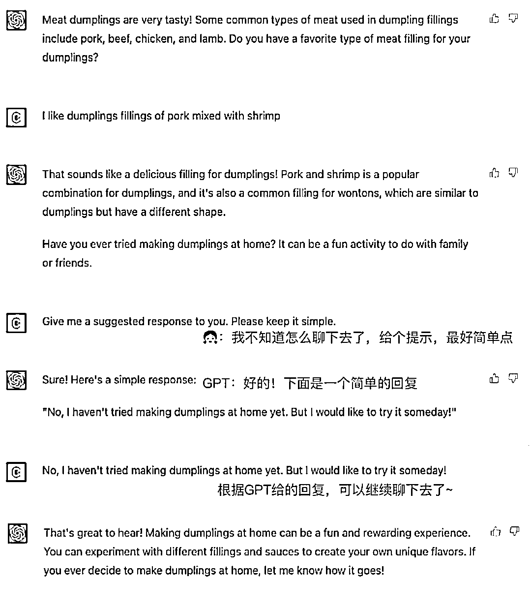
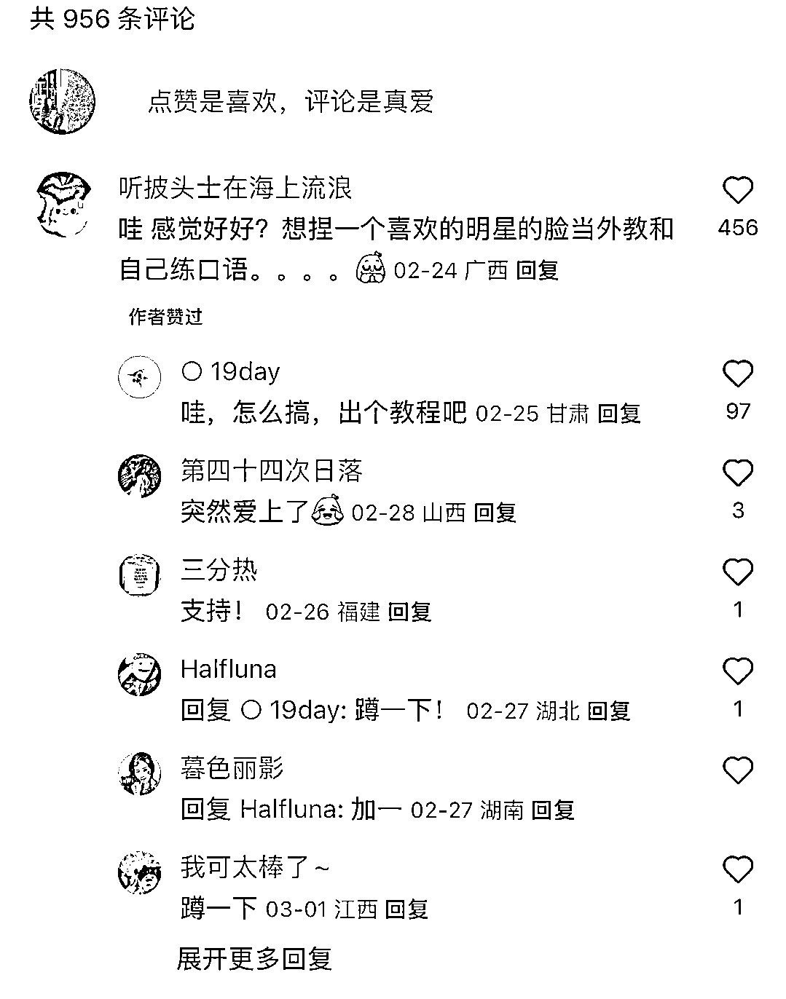

# 跟 ChatGPT 虚拟外教练口语，用 AIGC 生成了外教人像和视频

> 原文：[`www.yuque.com/for_lazy/xkrm14/puhvnetaw2qge531`](https://www.yuque.com/for_lazy/xkrm14/puhvnetaw2qge531)

作者： FCY

日期：2023-03-14

点赞数：35

<ne-hole id="u59e0b9a0" data-lake-id="u59e0b9a0">

正文：

跟 chatGPT 虚拟外教练口语，用 AIGC 生成了外教人像和视频，加上语音识别和双语翻译，解决了想要实时锻炼口语但无练习对象的问题。 需求目测很旺盛，毕竟想要练英语的人层出不穷。作者还开放了共创。

  <ne-p id="u6f506ea0" data-lake-id="u6f506ea0">  <ne-p id="ua46500c6" data-lake-id="ua46500c6">  <ne-p id="uf85dd5e0" data-lake-id="uf85dd5e0">  <ne-hole id="u23fc6105" data-lake-id="u23fc6105"><ne-p id="u8b0b8b02" data-lake-id="u8b0b8b02">评论区：

小牛 : 这是哪个小红书号啊？

FCY : 谢谢亦仁大大

FCY : 叫 Superd.的，你找下看

小牛 : 谢谢

<ne-hole id="ufd39a61f" data-lake-id="ufd39a61f">

公众号懒人找资源，懒人专属群分享

</ne-hole></ne-hole></ne-p></ne-p></ne-p></ne-p></ne-hole>