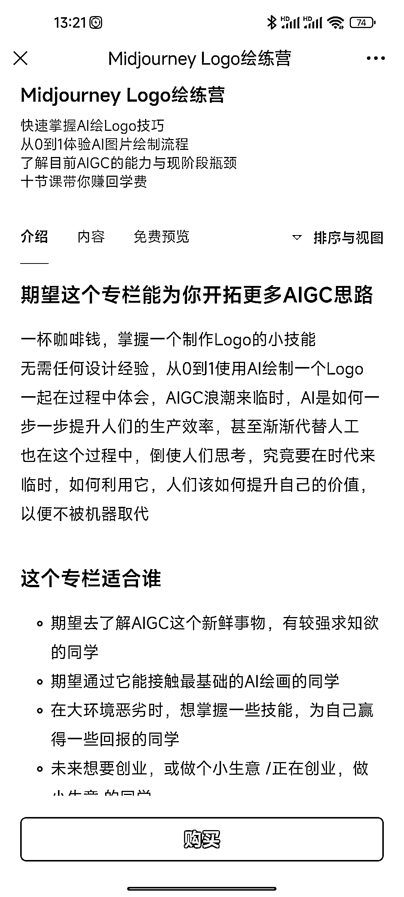

# Midjourney 的 LOGO 训练营，mj 结合细分领域制作课程

> 原文：[`www.yuque.com/for_lazy/xkrm14/zg060ssqevnhltq4`](https://www.yuque.com/for_lazy/xkrm14/zg060ssqevnhltq4)

作者： 发达

日期：2023-03-13

点赞数：21

正文：

midjourney 的 LOGO 训练营，mj 结合细分领域制作课程: 1.普通人学完可以当做赚钱的技能， 2.传统设计师学完提高工作效率 3.创业者学完自己设计 logo 这个定价是:29.9 元 延伸:mj 风景壁纸训练营，mj 海报训练营……

  

评论区：

飞哥 : 有地址吗

发达 : 小报童精选公众号里面的。

公众号懒人找资源，懒人专属群分享

</ne-p>