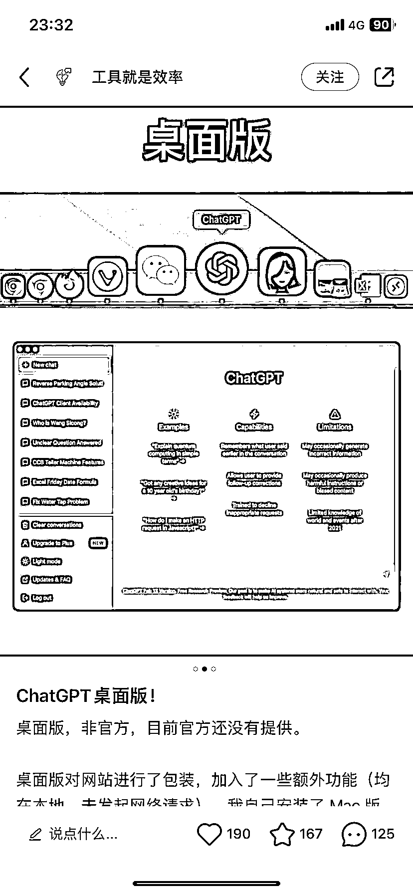

# ChatGPT 桌面版，需求非常大

> 原文：[`www.yuque.com/for_lazy/xkrm14/qr4h5kminsfpim6i`](https://www.yuque.com/for_lazy/xkrm14/qr4h5kminsfpim6i)

作者： 不亦樂乎

日期：2023-03-13

点赞数：14

正文：

chatGPT 桌面版，需求非常大啊！ 会弄的兄弟可以冲一波

  

  

  

  

  

评论区：

米斯特 LIu : 真是人才啊，啥也能想出来并能搞出来

不亦樂乎 : 但不得不说，这个还真是“刚需”， 甚至“一键召唤 chatgpt”，我觉得也很实用

干货哥 : 客户端 OpenCat 也不错

姬小光 : github 上有一款，其实就是内嵌网页

公众号懒人找资源，懒人专属群分享

