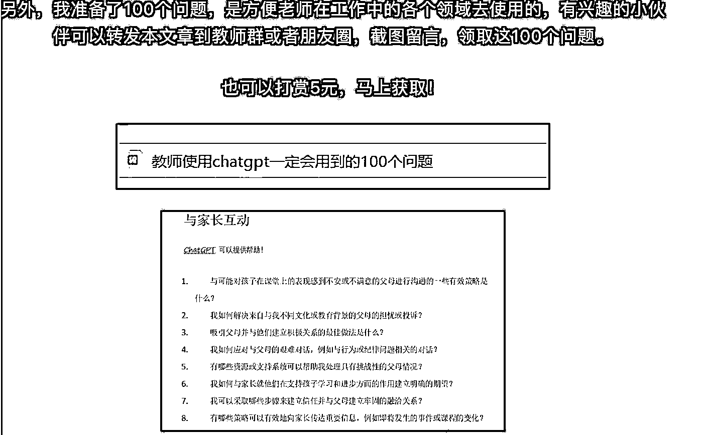

# chatgpt 结合每个都可以出使用教程，引流变现

> 原文：[`www.yuque.com/for_lazy/xkrm14/gfll2ygs388l5s4m`](https://www.yuque.com/for_lazy/xkrm14/gfll2ygs388l5s4m)

<ne-p id="ua729e258" data-lake-id="ua729e258"><ne-text id="u8df3d5a1">作者： 晨曦</ne-text></ne-p> <ne-p id="u8b239cb2" data-lake-id="u8b239cb2"><ne-text id="u445f8dda">日期：2023-03-17</ne-text></ne-p> <ne-p id="u70be8113" data-lake-id="u70be8113"><ne-text id="ucbaf4cde">点赞数：</ne-text><ne-text id="u1e9c50ea" ne-bold="true">158</ne-text></ne-p> <ne-hole id="u8a896a09" data-lake-id="u8a896a09"><ne-card data-card-name="hr" data-card-type="block" id="ehg0z" data-event-boundary="card"><ne-p id="u7a69db4f" data-lake-id="u7a69db4f"><ne-text id="u675aff53">正文：</ne-text></ne-p> <ne-p id="uadce4d0c" data-lake-id="uadce4d0c"><ne-text id="u9892f8ca">各行各业都可以出自己的使用手册，然后出教程，收客户～比如像这位教师一样</ne-text></ne-p> <ne-p id="ub9ad89d1" data-lake-id="ub9ad89d1"><ne-card data-card-name="image" data-card-type="inline" id="lLhRT" data-event-boundary="card">  <ne-hole id="u58d9dd38" data-lake-id="u58d9dd38"><ne-card data-card-name="hr" data-card-type="block" id="VHqak" data-event-boundary="card"><ne-p id="u38edfb13" data-lake-id="u38edfb13"><ne-text id="u5d136e3f">评论区：</ne-text></ne-p> <ne-p id="ue86e6460" data-lake-id="ue86e6460"><ne-text id="u2da72fc9">波叔 : 收集每个行业使用 ChatGPT 遇到的问题</ne-text></ne-p> <ne-p id="u8f3c6822" data-lake-id="u8f3c6822"><ne-text id="u914fcc2a">三农玲花 : 这个有启发 我可以对标想想我所在的行业使用手册 1，未来属于会使用 ChatGPT 的人 2，学会提问很重要 3，各行各业的常见问题场景</ne-text></ne-p> <ne-p id="u46366d52" data-lake-id="u46366d52"><ne-text id="ua8fab9e5">大江 : 如何利用 chatGPT 快速获取到各行业的使用手册？</ne-text></ne-p> <ne-p id="ud7d0ff1b" data-lake-id="ud7d0ff1b"><ne-text id="uf7947040">水哥爱搞钱 : 每一个提问都是一个需求痛点👍</ne-text></ne-p> <ne-p id="ufddba138" data-lake-id="ufddba138"><ne-text id="ube40ed72">薇姐买房 : 这个用来聚拢精准流量很好，更妙的是，连这个问题，都可以用 chat 来生成……</ne-text></ne-p> <ne-p id="u1cd8d8a4" data-lake-id="u1cd8d8a4"><ne-text id="u804c1986">程序员卡诺 : 求文章地址</ne-text></ne-p> <ne-hole id="ucd657489" data-lake-id="ucd657489"><ne-card data-card-name="hr" data-card-type="block" id="zBbg8" data-event-boundary="card"><ne-p id="ud5baaeee" data-lake-id="ud5baaeee"><ne-text id="ud709ff99">公众号懒人找资源，懒人专属群分享</ne-text></ne-p></ne-card></ne-hole></ne-card></ne-hole></ne-card></ne-p></ne-card></ne-hole>