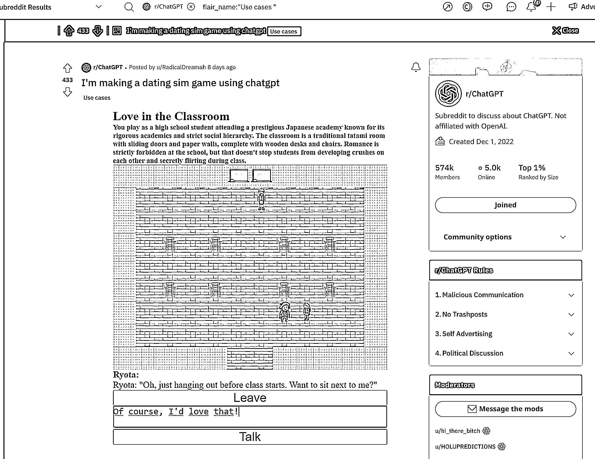

# 大量 chatgpt 应用案例的网站

> 原文：[`www.yuque.com/for_lazy/xkrm14/glqnk76t1z6vrqzq`](https://www.yuque.com/for_lazy/xkrm14/glqnk76t1z6vrqzq)

作者： 王马扎

日期：2023-03-17

点赞数：58

正文：

一个可以找到大量 chatgpt 应用案例的网站，而且每天还在不断更新。 reddit 上的一个 Communities 叫 r/ChatGPT，有个叫“use cases”的标签，通过这个入口可以看到大量有趣的应用 chatgpt 的案例！ 网址： 提示：需要会上网[https://www.reddit.com/r/ChatGPT/search/?q=flair_n...](https://www.reddit.com/r/ChatGPT/search/?q=flair_name%3A%22Use%20cases%20%22&restrict_sr=1&sr_nsfw=)

评论区：

暂无评论

公众号懒人找资源，懒人专属群分享

