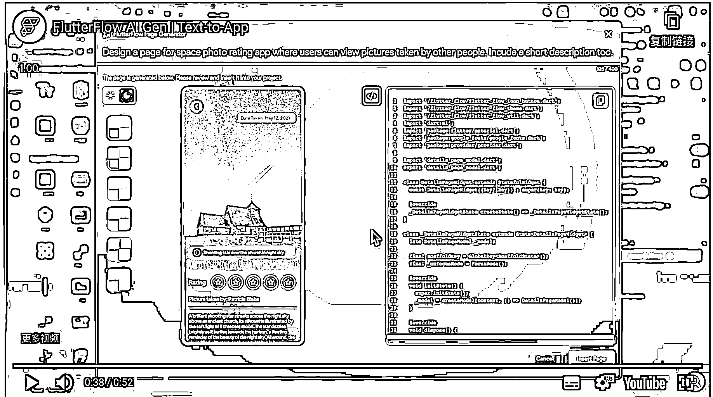

# 低代码应用平台，通过文本 prompt 直接生成 app 应用界面代码

> 原文：[`www.yuque.com/for_lazy/xkrm14/fin7uoqh3e538784`](https://www.yuque.com/for_lazy/xkrm14/fin7uoqh3e538784)

作者： 封小木

日期：2023-03-17

点赞数：23

<ne-hole id="u4258cf85" data-lake-id="u4258cf85">

正文：

低代码应用平台，新特性是通过文本 prompt 直接生成 app 应用界面代码 [https://flutterflow.io/ai-gen](https://flutterflow.io/ai-gen)

<ne-hole id="ub5a857ac" data-lake-id="ub5a857ac">

评论区：

暂无评论

<ne-hole id="u6595a010" data-lake-id="u6595a010">

公众号懒人找资源，懒人专属群分享

</ne-hole></ne-hole></ne-hole>