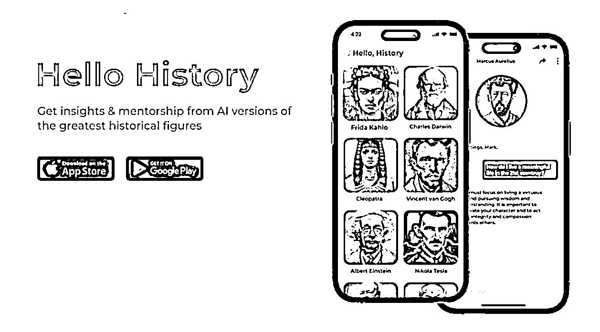

# ChatGPT 针对名人训练模型

> 原文：[`www.yuque.com/for_lazy/xkrm14/rdz8ohgixp41b9oh`](https://www.yuque.com/for_lazy/xkrm14/rdz8ohgixp41b9oh)

作者： 妙生

日期：2023-03-17

点赞数：34

正文：

创建名人了解机器人。把名人的资料（视频、文字、演讲稿等）用来训练机器模型，直接和这个名人聊天。 这个网站上有 N 个角色了，还开发了 APP： 如果可行，选对名人（如一些大佬），或者把家人的资料用来训练，或许有人感兴趣。[https://beta.character.ai/](https://beta.character.ai/)

  

评论区：

北纬 64 度 : 这个要科 xue 上 网么

妙生 : 点击网址试试

北纬 64 度 : 因为没打开成功所以才问的，不确定是我手机问题当时网络不好还是需要那个网

庭峰🍂 : 這個有什麼用

姬小光 : 前面有人分享跟历史名人对话的 prompt，这应该就是基于那份资料

姬小光 : 意识形态植入[奸笑]

邹培盛 : 科学后可以打开的

公众号懒人找资源，懒人专属群分享

</ne-p>