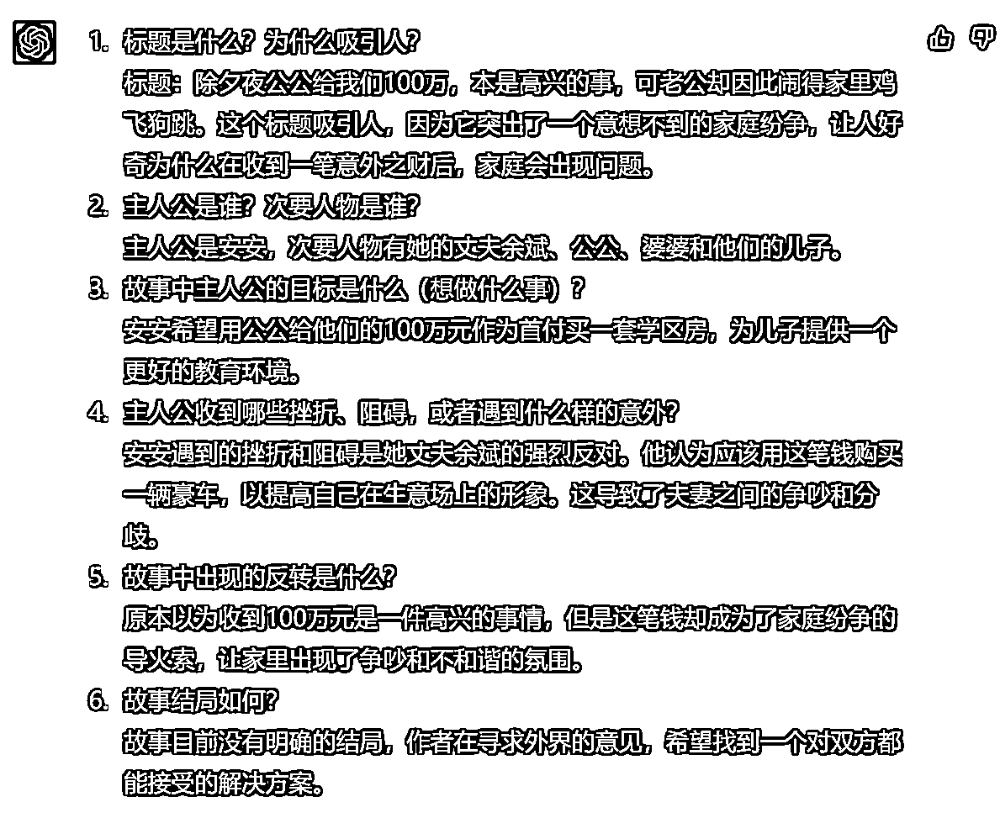

# 用 ChatGPT 快速搭建爆文素材库

> 原文：[`www.yuque.com/for_lazy/xkrm14/kzm5s7l1tfuiuvn2`](https://www.yuque.com/for_lazy/xkrm14/kzm5s7l1tfuiuvn2)

作者： 木白

日期：2023-03-17

点赞数：60

正文：

用 ChatGPT 快速搭建爆文素材库。 学习《公众号爆文写作》航海手册，看到搭建素材库这点。正是 ChatGPT 的强项。找篇爆文，让 ChatGPT 分析总结，1 分钟出结果。找几十篇爆文，半天搞定素材库。再也不怕写故事没素材了。 prompt 如下： 现在你是一位故事写作专家，擅长写：情感故事、家庭伦理故事等反应普通人问题生活的故事。接下来你要对我提供故事做出分析，然后给出以下 6 点： 1\. 标题是什么？为什么吸引人？ 2\. 主人公是谁？次要人物是谁？ 3\. 故事中主人公的目标是什么（想做什么事）？ 4. 主人公收到哪些挫折、阻碍，或者遇到什么样的意外？ 5\. 故事中出现的反转是什么？ 6\. 故事结局如何？ 可以做的的话，请回答”可以“。然后我会发送故事给你。开始之后，我提供的所有信息都按照上面的 6 点来分析，直到我说”停止“。

评论区：

经济基础 : 没太明白 请问最后积累的什么素材呢？

木白 : 《公众号爆文写作》航海手册航海手册上写了，这 6 部分素材素材积累几十条，写故事的混搭一下，够写一年的

