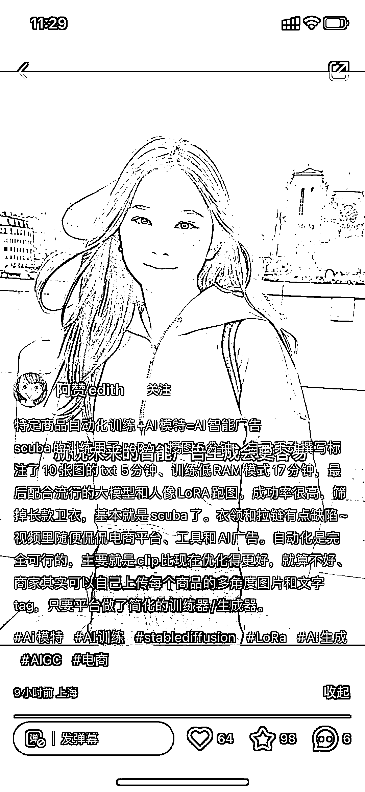

# 特定商品自动化训练+AI 模特，AI 智能广告

> 原文：[`www.yuque.com/for_lazy/xkrm14/hf3fgrmiezbehkga`](https://www.yuque.com/for_lazy/xkrm14/hf3fgrmiezbehkga)

作者： 方糖呐

日期：2023-03-17

点赞数：35

正文：

之前有圈友提到过的 AI 模特 刚好看到小红书有人发教程： 特定商品自动化训练+AI 模特=AI 智能广告 scuba 的训练用了 LoRA，搜图 5 分钟、自己手动撰写标注了 10 张图的 txt 5 分钟、训练低 RAM 模式 17 分钟，最后配合流行的大模型和人像 LoRA 跑图。成功率很高，筛掉长款卫衣，基本就是 scuba 了。衣领和拉链有点缺陷~ 视频里随便侃侃电商平台、工具和 AI 广告。自动化是完全可行的，主要就是 clip 比现在优化得更好，就算不好、商家其实可以自己上传每个商品的多角度图片和文字 tag，只要平台做了简化的训练器/生成器。 感觉可以做变现的方向： 1⃣️替商家生成 AI 模特 2⃣️卖训练教程[小红书](http://xhslink.com/LFpsao)

评论区：

暂无评论

公众号懒人找资源，懒人专属群分享

