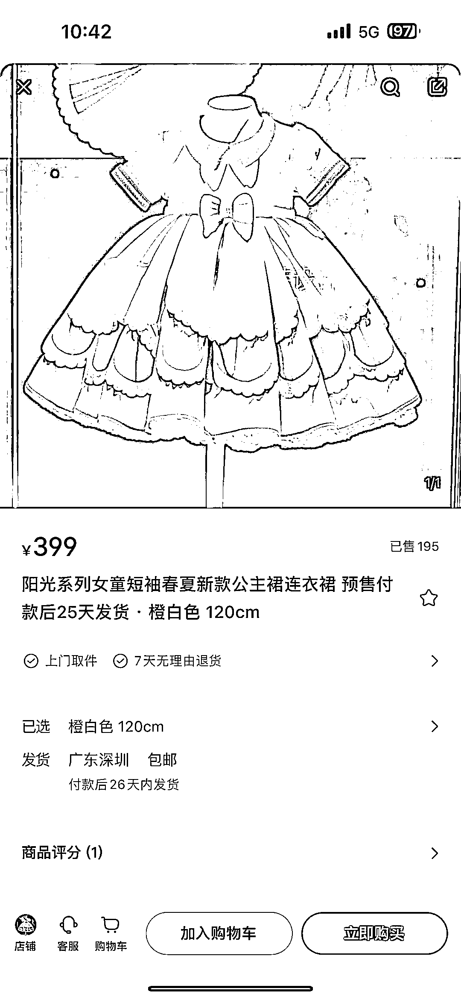
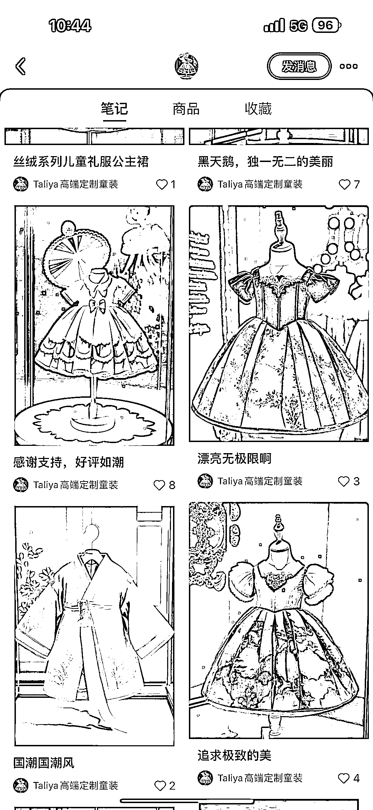

# AI 绘画做服装设计，根据互动数据，下单生产

> 原文：[`www.yuque.com/for_lazy/xkrm14/lepdnfqv07gtppd3`](https://www.yuque.com/for_lazy/xkrm14/lepdnfqv07gtppd3)

作者： 斑马森林

日期：2023-03-17

点赞数：22

<ne-hole id="u0afafb97" data-lake-id="u0afafb97">

正文：

AI 的出现，解放了生产力 通过 AI 绘画来做服装设计，切入童装赛道 作品分发到流量平台，根据数据反馈的情况 可以走预售，再找厂家投入生产，降低成本

<ne-hole id="u5c3b63e4" data-lake-id="u5c3b63e4">

评论区：

暂无评论

<ne-hole id="ua55c9d85" data-lake-id="ua55c9d85">

公众号懒人找资源，懒人专属群分享

</ne-hole></ne-hole></ne-hole>