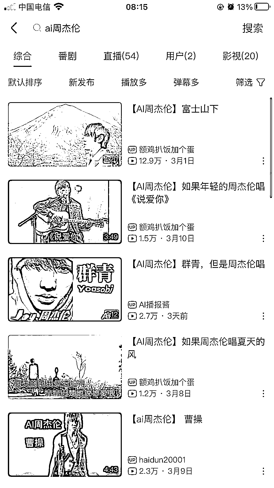

# AI 用明星的声音去翻唱抖音流行的歌曲，变现思路分享

> 原文：[`www.yuque.com/for_lazy/xkrm14/pr2gn0asny5mu9ki`](https://www.yuque.com/for_lazy/xkrm14/pr2gn0asny5mu9ki)

<ne-p id="u7aecf37b" data-lake-id="u7aecf37b"><ne-text id="ua5c906fd">作者： 好六</ne-text></ne-p> <ne-p id="u98e58576" data-lake-id="u98e58576"><ne-text id="uaf331b3b">日期：2023-03-17</ne-text></ne-p> <ne-p id="u437cbdb1" data-lake-id="u437cbdb1"><ne-text id="u8fa1cd54">点赞数：</ne-text><ne-text id="uf3a0fecc" ne-bold="true">15</ne-text></ne-p> <ne-hole id="uf473d702" data-lake-id="uf473d702"><ne-card data-card-name="hr" data-card-type="block" id="MrcuU" data-event-boundary="card"><ne-p id="uf18727da" data-lake-id="uf18727da"><ne-text id="u3fbaff86">正文：</ne-text></ne-p> <ne-p id="u1d11e886" data-lake-id="u1d11e886"><ne-text id="u6df6ad8f">用 AI 翻唱让周杰伦唱吴梅子酱，星友可以关注下，可以做矩阵号，用明星的声音去翻唱抖音流行的歌曲，比如用 ai</ne-text> <ne-text id="u53c214c0">周杰伦翻唱二手玫瑰的仙儿，最基础的就是赚平台分成，阶进一下卖 U 盘，高级的就是引流教学卖课 199 元/人，每多 100 人涨价 100 元[旺柴]</ne-text></ne-p> <ne-p id="ubd79ea13" data-lake-id="ubd79ea13"><ne-card data-card-name="image" data-card-type="inline" id="DS6GL" data-event-boundary="card">  <ne-hole id="u3e458d9e" data-lake-id="u3e458d9e"><ne-card data-card-name="hr" data-card-type="block" id="kL3Ik" data-event-boundary="card"><ne-p id="ue5a2c126" data-lake-id="ue5a2c126"><ne-text id="ufbe3f043">评论区：</ne-text></ne-p> <ne-p id="u768b1870" data-lake-id="u768b1870"><ne-text id="u0416aead">猫哥 : 这个会有版权问题吗</ne-text></ne-p> <ne-p id="u05b8de6d" data-lake-id="u05b8de6d"><ne-text id="u793587c8">好六 : 月收入不到 7 位数就没有必要考虑版权问题</ne-text></ne-p> <ne-p id="u4f4ebf09" data-lake-id="u4f4ebf09"><ne-text id="u7e8310dd">猫哥 : 😂</ne-text></ne-p> <ne-p id="uc52097d2" data-lake-id="uc52097d2"><ne-text id="ub713e213">好六 : 我感觉是那么回事，侵权咱们就删除唄，挣的就是这个钱</ne-text></ne-p> <ne-p id="u8ccb88d1" data-lake-id="u8ccb88d1"><ne-text id="u4ce3d977">猫哥 : 嗯嗯</ne-text></ne-p> <ne-p id="ua23b6a47" data-lake-id="ua23b6a47"><ne-text id="udc068c6c">闲米 : 用什么制作的？</ne-text></ne-p> <ne-p id="u32531899" data-lake-id="u32531899"><ne-text id="u5320d94f">好六 : 不好意思，我只是发现了风向标而已</ne-text></ne-p> <ne-hole id="u0ad700e7" data-lake-id="u0ad700e7"><ne-card data-card-name="hr" data-card-type="block" id="BrhBm" data-event-boundary="card"><ne-p id="u0dec591d" data-lake-id="u0dec591d"><ne-text id="u463f6500">公众号懒人找资源，懒人专属群分享</ne-text></ne-p></ne-card></ne-hole></ne-card></ne-hole></ne-card></ne-p></ne-card></ne-hole>