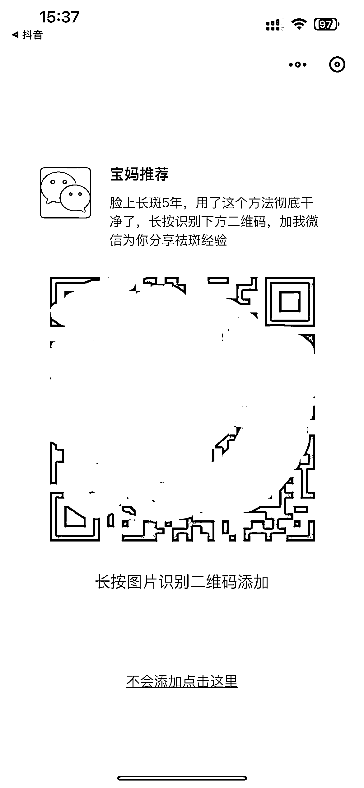
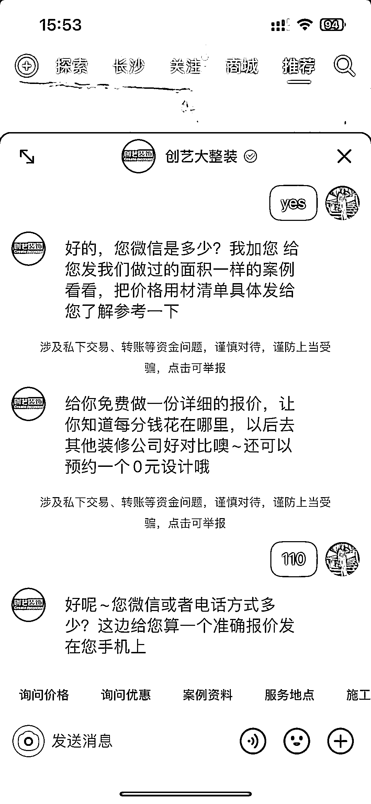

# 抖音一对一咨询解答，引流到私域变现

> 原文：[`www.yuque.com/for_lazy/xkrm14/hvnzdohpsdu7erzb`](https://www.yuque.com/for_lazy/xkrm14/hvnzdohpsdu7erzb)

<ne-p id="u29575e6f" data-lake-id="u29575e6f"><ne-text id="u41594fd9">作者： 只吃烤肉</ne-text></ne-p> <ne-p id="uc4d25fb4" data-lake-id="uc4d25fb4"><ne-text id="u22578a65">日期：2023-03-16</ne-text></ne-p> <ne-p id="u57dc911f" data-lake-id="u57dc911f"><ne-text id="uc2ca2eb9">点赞数：</ne-text><ne-text id="u832746d8" ne-bold="true">30</ne-text></ne-p> <ne-hole id="u5677e1ca" data-lake-id="u5677e1ca"><ne-card data-card-name="hr" data-card-type="block" id="sWXVm" data-event-boundary="card"><ne-p id="u84bdc202" data-lake-id="u84bdc202"><ne-text id="u04c0ec8e">正文：</ne-text></ne-p> <ne-p id="u46e61e93" data-lake-id="u46e61e93"><ne-text id="u10df9f78">抖音现在有这种一对一咨询解答，点击链接就会弹出图二，然后根据指引，点击那个领取方法就会弹出博主的微信，点击打开就有博主的微信二维码，直接扫码添加。</ne-text> <ne-text id="u3258668f">还有这种装修公司搞咨询做设计也可以直接问微信直接倒流到私域。 这个方法也很适合引流到私域，然后无论是卖课还是卖产品还是做实体店生意都非常 nice！</ne-text></ne-p> <ne-p id="ud0aca524" data-lake-id="ud0aca524"><ne-card data-card-name="image" data-card-type="inline" id="JVknS" data-event-boundary="card">  <ne-p id="u814acc09" data-lake-id="u814acc09"><ne-card data-card-name="image" data-card-type="inline" id="AUctQ" data-event-boundary="card"></ne-card></ne-p> <ne-p id="u888be681" data-lake-id="u888be681"><ne-card data-card-name="image" data-card-type="inline" id="vMa0P" data-event-boundary="card">  <ne-p id="u6e4bc27b" data-lake-id="u6e4bc27b"><ne-card data-card-name="image" data-card-type="inline" id="aZsme" data-event-boundary="card"></ne-card></ne-p> <ne-p id="u30c9841c" data-lake-id="u30c9841c"><ne-card data-card-name="image" data-card-type="inline" id="n8o8q" data-event-boundary="card"></ne-card></ne-p> <ne-p id="u29b81ac5" data-lake-id="u29b81ac5"><ne-card data-card-name="image" data-card-type="inline" id="gsMTU" data-event-boundary="card"></ne-card></ne-p> <ne-p id="u88172655" data-lake-id="u88172655"><ne-card data-card-name="image" data-card-type="inline" id="eBZK6" data-event-boundary="card">  <ne-hole id="u4e4b095f" data-lake-id="u4e4b095f"><ne-card data-card-name="hr" data-card-type="block" id="qsqdU" data-event-boundary="card"><ne-p id="uaa2f3fb5" data-lake-id="uaa2f3fb5"><ne-text id="u58d47e1d">评论区：</ne-text></ne-p> <ne-p id="ub9f3901f" data-lake-id="ub9f3901f"><ne-text id="u5e5c4958">abc : 视频左下角现在没法开，私信卡片跳 v 可以的</ne-text></ne-p> <ne-p id="u8f5c8ad5" data-lake-id="u8f5c8ad5"><ne-text id="ub987a441">强哥手记 : 这是什么软件？</ne-text></ne-p> <ne-p id="u8f49902c" data-lake-id="u8f49902c"><ne-text id="u1846c2c0">只吃烤肉 : 抖音啊</ne-text></ne-p> <ne-p id="u59b99161" data-lake-id="u59b99161"><ne-text id="u29ae6b87">封伟-自动化变现 : 私信转发引流卡片容易封 比较稳定的有两种走群跳转和小风车跳转微信</ne-text></ne-p> <ne-hole id="ufcce7aa7" data-lake-id="ufcce7aa7"><ne-card data-card-name="hr" data-card-type="block" id="GHzFk" data-event-boundary="card"><ne-p id="u9ee80cf6" data-lake-id="u9ee80cf6"><ne-text id="uf63799e8">公众号懒人找资源，懒人专属群分享</ne-text></ne-p></ne-card></ne-hole></ne-card></ne-hole></ne-card></ne-p></ne-card></ne-p></ne-card></ne-p></ne-card></ne-hole>