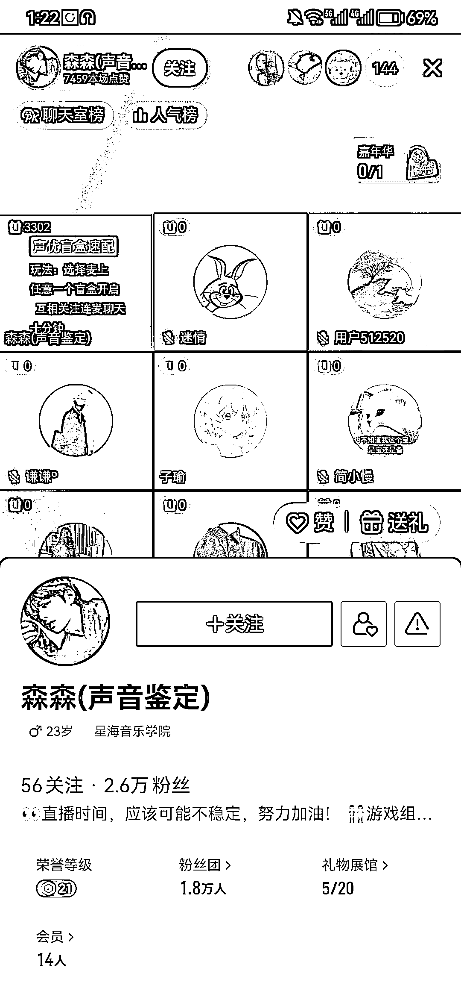
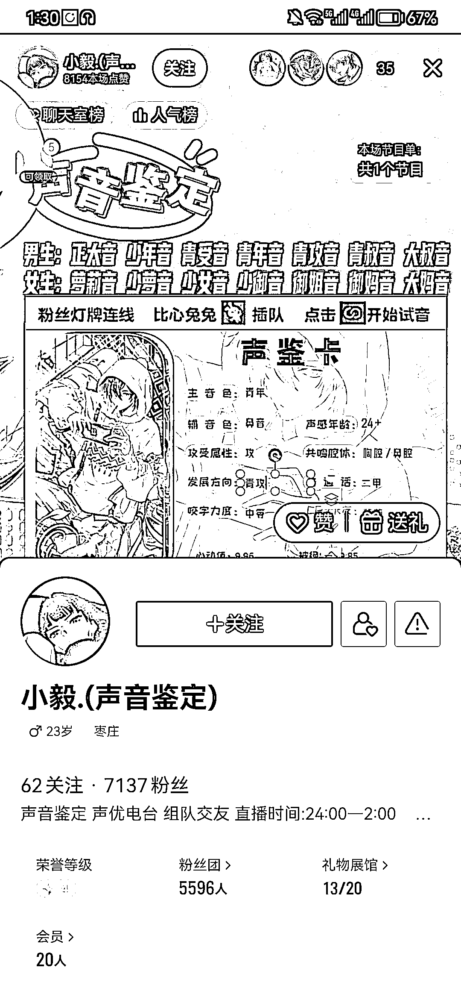

# 抖音声音鉴定，变现思路

> 原文：[`www.yuque.com/for_lazy/xkrm14/ii185a9yxzfk4ifd`](https://www.yuque.com/for_lazy/xkrm14/ii185a9yxzfk4ifd)

作者： 罗马骁尧

日期：2023-03-13

点赞数：10

<ne-hole id="u3d0d009c" data-lake-id="u3d0d009c">

正文：

抖音上声音鉴定，从音色，共鸣腔体，发展方向，普通话，咬字等角度去鉴定。连麦互动，粉丝团人数很高。可以充值会员连麦，撮合情侣，做声音培训，推兼职配音等方式变现。

  <ne-p id="u4914f49f" data-lake-id="u4914f49f">  <ne-hole id="u7a3449aa" data-lake-id="u7a3449aa"><ne-p id="u53a8a229" data-lake-id="u53a8a229">评论区：

<ne-hole id="u461e318b" data-lake-id="u461e318b">

公众号懒人找资源，懒人专属群分享

</ne-hole></ne-hole></ne-p></ne-p></ne-hole>