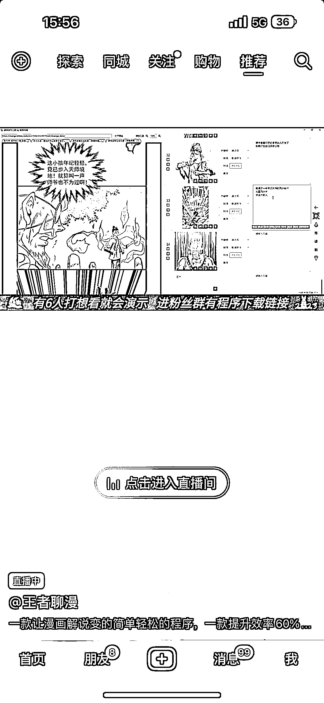

# 抖音上的漫画解说，可以结合 AI 绘画来做

> 原文：[`www.yuque.com/for_lazy/xkrm14/ir3uhpilu6txmw7l`](https://www.yuque.com/for_lazy/xkrm14/ir3uhpilu6txmw7l)

<ne-p id="u1c33d930" data-lake-id="u1c33d930"><ne-text id="ud05a8836">作者： 斑马森林</ne-text></ne-p> <ne-p id="u1504fee6" data-lake-id="u1504fee6"><ne-text id="u384c04e4">日期：2023-03-17</ne-text></ne-p> <ne-p id="u501f6a67" data-lake-id="u501f6a67"><ne-text id="ue9411cef">点赞数：</ne-text><ne-text id="u90c3bd98" ne-bold="true">49</ne-text></ne-p> <ne-hole id="u172abe6c" data-lake-id="u172abe6c"><ne-card data-card-name="hr" data-card-type="block" id="xYNHW" data-event-boundary="card"><ne-p id="u057424a7" data-lake-id="u057424a7"><ne-text id="u8f992240">正文：</ne-text></ne-p> <ne-p id="u5db3ffe4" data-lake-id="u5db3ffe4"><ne-text id="u5f582832">抖音上的漫画解说，可以结合 AI 绘画来做</ne-text></ne-p> <ne-p id="u1127a3a7" data-lake-id="u1127a3a7"><ne-card data-card-name="image" data-card-type="inline" id="VR10R" data-event-boundary="card">  <ne-p id="ue67f1e1e" data-lake-id="ue67f1e1e"><ne-card data-card-name="image" data-card-type="inline" id="Og2Lq" data-event-boundary="card">  <ne-hole id="ue2a5d2a3" data-lake-id="ue2a5d2a3"><ne-card data-card-name="hr" data-card-type="block" id="DkPan" data-event-boundary="card"><ne-p id="u11eeb493" data-lake-id="u11eeb493"><ne-text id="uf57c2bc7">评论区：</ne-text></ne-p> <ne-p id="u6f3ff95f" data-lake-id="u6f3ff95f"><ne-text id="u661248aa">暂无评论</ne-text></ne-p> <ne-hole id="uce66549a" data-lake-id="uce66549a"><ne-card data-card-name="hr" data-card-type="block" id="FlI3f" data-event-boundary="card"><ne-p id="u0abe9fea" data-lake-id="u0abe9fea"><ne-text id="uf551e151">公众号懒人找资源，懒人专属群分享</ne-text></ne-p></ne-card></ne-hole></ne-card></ne-hole></ne-card></ne-p></ne-card></ne-p></ne-card></ne-hole>