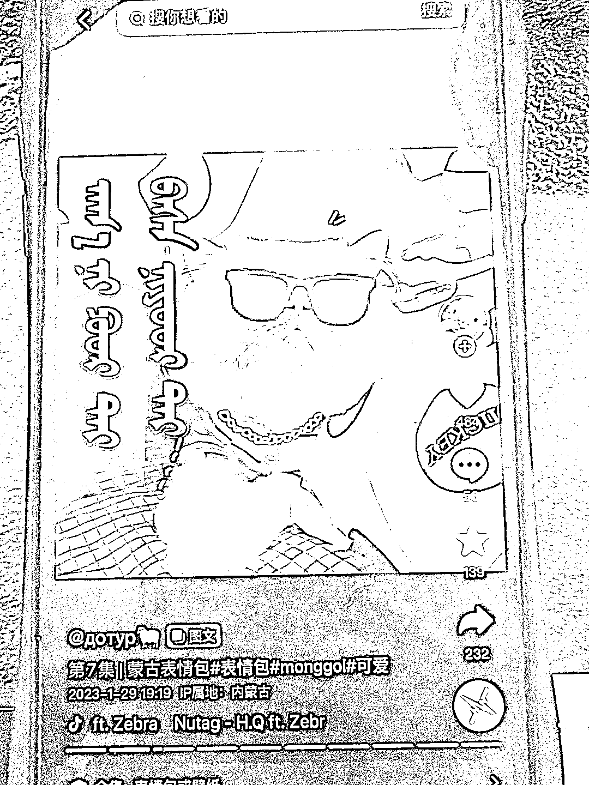

# 抖音蒙语表情包，精准引流蒙语人群

> 原文：[`www.yuque.com/for_lazy/xkrm14/tahhucl0bxusgokf`](https://www.yuque.com/for_lazy/xkrm14/tahhucl0bxusgokf)

<ne-p id="ub4178772" data-lake-id="ub4178772"><ne-text id="ua975d983">作者： 乔久伴</ne-text></ne-p> <ne-p id="ufd61041e" data-lake-id="ufd61041e"><ne-text id="uc0da6472">日期：2023-03-17</ne-text></ne-p> <ne-p id="u1266ac9e" data-lake-id="u1266ac9e"><ne-text id="u530a3aa3">点赞数：</ne-text><ne-text id="ubc6f4951" ne-bold="true">19</ne-text></ne-p> <ne-hole id="u3516cc56" data-lake-id="u3516cc56"><ne-card data-card-name="hr" data-card-type="block" id="kjkz7" data-event-boundary="card"><ne-p id="uef8ff4d7" data-lake-id="uef8ff4d7"><ne-text id="u9ea72136">正文：</ne-text></ne-p> <ne-p id="u2a436ed4" data-lake-id="u2a436ed4"><ne-text id="uc1c9f9a5">表情包引流精准蒙族同胞，私域可以卖蒙族的书，佛像等等</ne-text></ne-p> <ne-p id="ubb4cfdf7" data-lake-id="ubb4cfdf7"><ne-card data-card-name="image" data-card-type="inline" id="AZhBZ" data-event-boundary="card"></ne-card></ne-p> <ne-hole id="ubdcefa55" data-lake-id="ubdcefa55"><ne-card data-card-name="hr" data-card-type="block" id="WA8VR" data-event-boundary="card"><ne-p id="u96187fc8" data-lake-id="u96187fc8"><ne-text id="ub6a95bb5">评论区：</ne-text></ne-p> <ne-p id="ud05093d4" data-lake-id="ud05093d4"><ne-text id="uffdc90ec">暂无评论</ne-text></ne-p> <ne-hole id="uaafdae6c" data-lake-id="uaafdae6c"><ne-card data-card-name="hr" data-card-type="block" id="fn86V" data-event-boundary="card"><ne-p id="u3040235d" data-lake-id="u3040235d"><ne-text id="u4358a902">公众号懒人找资源，懒人专属群分享</ne-text></ne-p></ne-card></ne-hole></ne-card></ne-hole></ne-card></ne-hole>