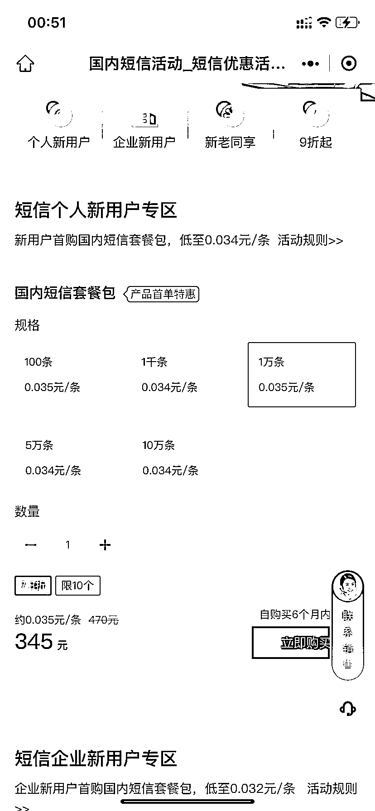

# 腾讯云短信营销功能

> 原文：[`www.yuque.com/for_lazy/xkrm14/fry9s9vrsgbzpmgm`](https://www.yuque.com/for_lazy/xkrm14/fry9s9vrsgbzpmgm)

作者： 三亚卖金枪鱼和野生鱼

日期：2023-03-15

点赞数：14

<ne-hole id="u90164dba" data-lake-id="u90164dba">

正文：

腾讯云短信营销，新用户，发一万条，费用才 300 多。 假设自己的产品是高客单高毛利高复购，手上有一批泛粉手机号资源，通过短信营销，按 1%的添加，再进行成交转化，这费用真是太便宜了。 主要会存在一些风险，大家聊聊

  <ne-hole id="u3e7bc415" data-lake-id="u3e7bc415"><ne-p id="u98738f6f" data-lake-id="u98738f6f">评论区：

大江 : 主要要 roi 能跑正，资源要够稳定持久

抖 sir : 如果被投诉的话直接封你不商量

闲米 : 一般要申请模板，模板不一定审核过，审核过了内容被投诉了还会...

苏生 : 这个 APP 叫什么呢？搜索了腾讯云没找到

<ne-hole id="u896b0c3e" data-lake-id="u896b0c3e">

公众号懒人找资源，懒人专属群分享

</ne-hole></ne-hole></ne-p></ne-hole>