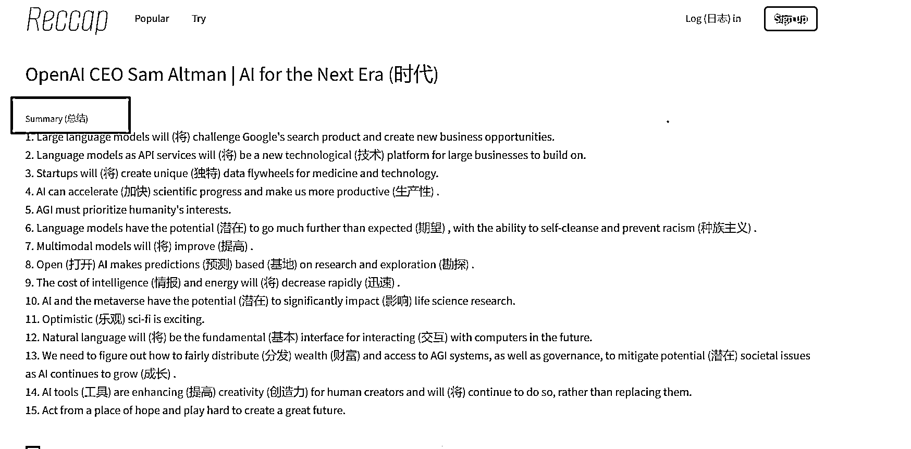
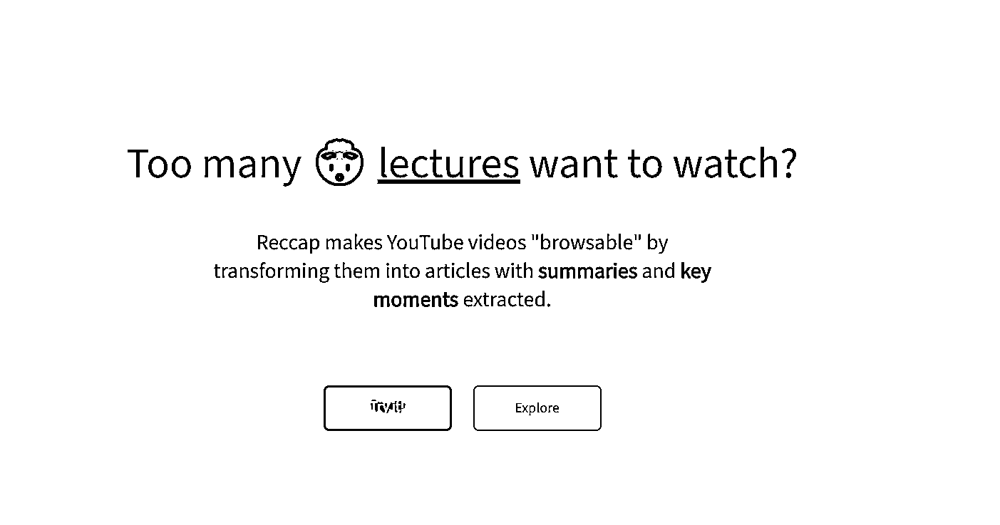

# 工具推荐：把视频转化为图文，方便检索

> 原文：[`www.yuque.com/for_lazy/xkrm14/igmbrm0f5ngnvpgp`](https://www.yuque.com/for_lazy/xkrm14/igmbrm0f5ngnvpgp)

作者： shine_fore*

日期：2023-03-13

点赞数：11

<ne-hole id="u220c82c3" data-lake-id="u220c82c3"><ne-card data-card-name="hr" data-card-type="block" id="hZYsD" data-event-boundary="card">

正文：

这个这个产品，不仅仅只是总结视频的内容，还把 Youtube 视频转换为图文，方便浏览检索和分享； 甚至可以把视频中的每一段话的“关键观点提取出来； 而且还把视频转化为图文的消息作为网站内容，这个不是一个被动生成内容的机器了吗？ 我不知道这个有没版权问题，但是从被动生产原创内容，和容易被搜索引擎收录角度，我觉得这个思路是非常厉害的！ 把视频转化为图文，是一种不错的场景，比较看文字，这个掌控是由自己决定的，可以一目十行，但是看视频掌控是由视频本身控制； 并且如果视频转化为图文和对应章节的图片和文字，方便对视频里面内容做笔记，不管是从产生内容，或者用户留存角度，都是一个很不错的思路。 Reccap - Reccap makes YouTube videos browsable

<ne-card data-card-name="image" data-card-type="inline" id="Nt8vh" data-event-boundary="card">  <ne-p id="uea056991" data-lake-id="uea056991"><ne-card data-card-name="image" data-card-type="inline" id="lMw6U" data-event-boundary="card">  <ne-p id="u976a4b3e" data-lake-id="u976a4b3e"><ne-card data-card-name="image" data-card-type="inline" id="AglbB" data-event-boundary="card">  <ne-hole id="u0b66e9a4" data-lake-id="u0b66e9a4"><ne-card data-card-name="hr" data-card-type="block" id="ctVJf" data-event-boundary="card"><ne-p id="u2b0c5fd9" data-lake-id="u2b0c5fd9">评论区：

<ne-hole id="u182f6c37" data-lake-id="u182f6c37"><ne-card data-card-name="hr" data-card-type="block" id="TlFLY" data-event-boundary="card">

公众号懒人找资源，懒人专属群分享

</ne-card></ne-hole></ne-card></ne-hole></ne-card></ne-p></ne-card></ne-p></ne-card></ne-p></ne-card></ne-hole>