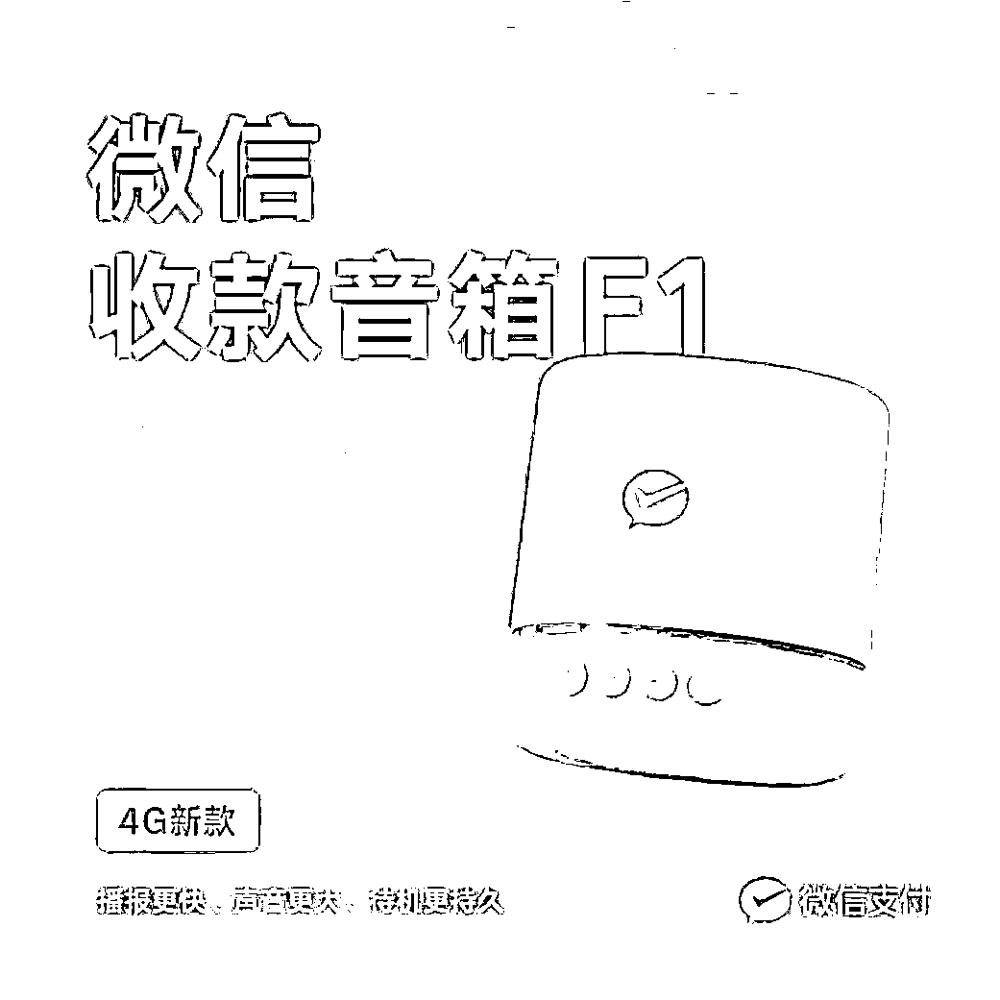
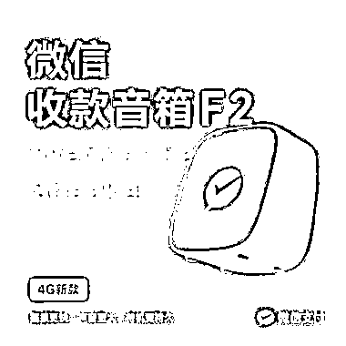
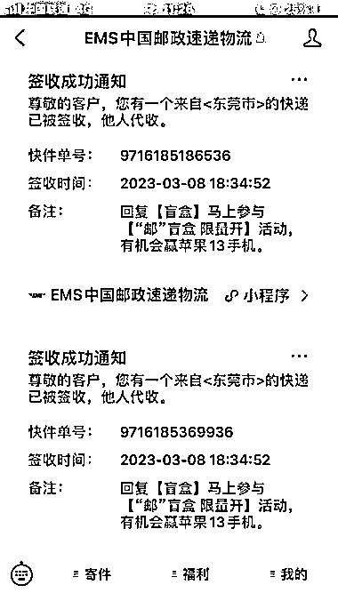

# 地推拉新 B 端项目，微信积分兑换收款音响，赚差价

> 原文：[`www.yuque.com/for_lazy/xkrm14/fshhuy3emzze5keq`](https://www.yuque.com/for_lazy/xkrm14/fshhuy3emzze5keq)

作者： Violen（昱龙说*

日期：2023-03-17

点赞数：13

正文：

地推拉新 B 端项目，微信积分兑换收款音响，收款 1 元得 1 积分，10 万积分可换取 F1F2 任意一款，我们利用信息差去低价回收。 拉新单价 90，周期项目，每年都有。个人跑，成本大概 30，一天出个十几二十单很正常，当天结算。 认真做确实可以做到单人日入上千。 测过最好的套路就是拉着一辆拖车，里面驮着大包小包的大米，食用油等日用品，招摇过市，赠送礼品的大气，利用从众心理，批量解决市场商户档主他们的信任问题。 更简单快速的方式是直接问微信积分收购收款音响，30 块卖不卖？ 缺点，也是门槛低，音响的价格明显，商家，兼职稍微有点心思都能复制，所以难放大，带兼职容易培养出竞争对手，知道门路很容易找到更高价的收购人。

  

  

  

评论区：

赈早见海 : 10 万积分可换取 10 万的免费提现额度，可以值 100 块，感觉稍微精明一点的都不会去换[捂脸]

Violen（昱龙说* : 哈哈，对的，我也觉得，但是做生意的左手进右手出，他们没有太多提现的需求。漏斗是这样的，知不知道积分可以换音箱？有没有足够的积分？有足够的积分会换其他产品吗，比如平台上雨伞，保温杯(音箱大部分生意人已经有了，多一个多余，换其他的会好点)？信不信任你，愿不愿意给你换？换多少钱/什么礼品？

