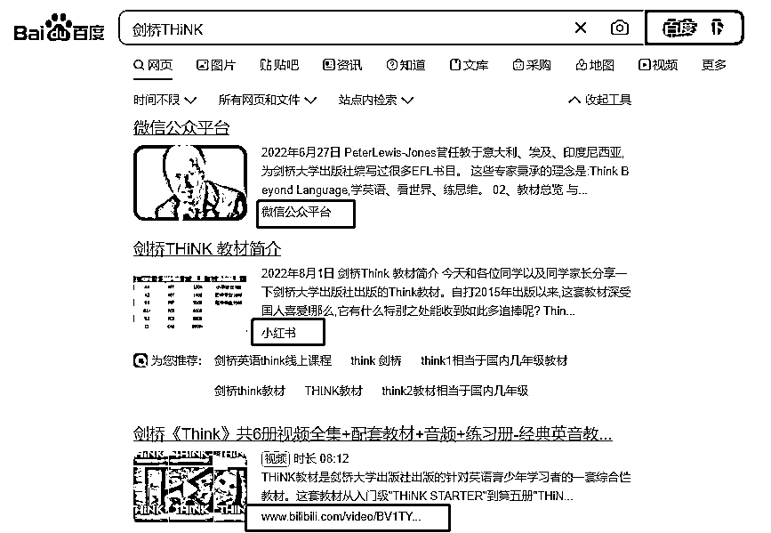

# 百度可搜索小红书笔记，SEO 的机会

> 原文：[`www.yuque.com/for_lazy/xkrm14/gxgs7mlgkpz5io77`](https://www.yuque.com/for_lazy/xkrm14/gxgs7mlgkpz5io77)

作者： 流年

日期：2023-03-16

点赞数：61

正文：

百度搜索×小红书 不知道有没有大佬发过，现在不仅可以搜索到微信公众号内容，小红书也可以了，而且权重非常之高。又是一大波 SEO 的机会

  

评论区：

潮州痞子蔡 : 互联互通

流年 : 之前各大 APP 的数据都是封闭的，现在是越来越开放了

潮州痞子蔡 : 国家要求的，所以这也诞生了很多机会

流年 : 这也是在扶持百度吧[偷笑]

潮州痞子蔡 : 都有好处

转评赞 : 百度是害群之马。

流年 : 是滴，对于不懂互联网的，百度营销真的是坑。对于我们其实还好，装几个插件就都解决了大部分问题[偷笑]

公众号懒人找资源，懒人专属群分享

</ne-p>