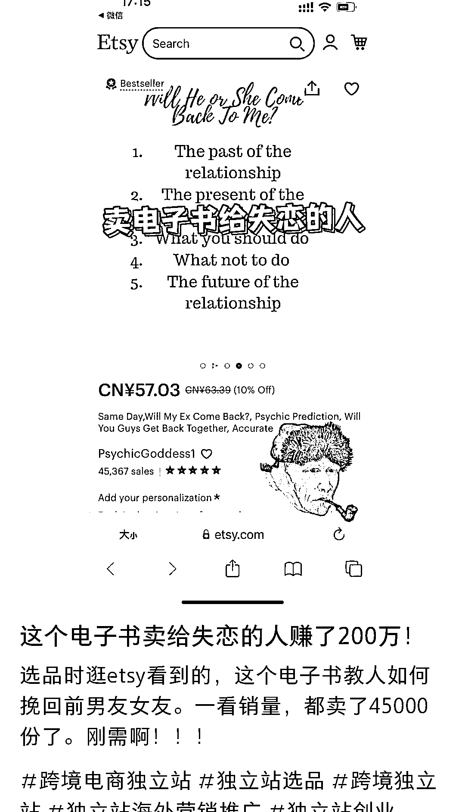

# 小红书 GPT 情感问答账号，数据好

> 原文：[`www.yuque.com/for_lazy/xkrm14/mrknqkdti7re5yw7`](https://www.yuque.com/for_lazy/xkrm14/mrknqkdti7re5yw7)

<ne-p id="u5f3f50af" data-lake-id="u5f3f50af"><ne-text id="ufe2f6501">作者： 鱼</ne-text></ne-p> <ne-p id="u012bcf8d" data-lake-id="u012bcf8d"><ne-text id="uc9273b08">日期：2023-03-16</ne-text></ne-p> <ne-p id="u3c018ba0" data-lake-id="u3c018ba0"><ne-text id="uc1417002">点赞数：</ne-text><ne-text id="uc1aa05af" ne-bold="true">46</ne-text></ne-p> <ne-hole id="u6ef7d3a7" data-lake-id="u6ef7d3a7"><ne-card data-card-name="hr" data-card-type="block" id="TCtfq" data-event-boundary="card"><ne-p id="u7851b385" data-lake-id="u7851b385"><ne-text id="u8440bcb0">正文：</ne-text></ne-p> <ne-p id="ua61dfe3a" data-lake-id="ua61dfe3a"><ne-text id="uc78d680c">之前发的小红书 gpt 问答账号(）</ne-text> <ne-text id="uc1d70652">不到一个月涨粉 3w，追踪了一下，情感类的问题最受欢迎。然后刷到了在 etsy 上面卖虚拟文档给失恋的人，也完全可以用 gpt 来撰写。</ne-text>[<ne-text id="u8a639ab0">https://t.zsxq.com/0cDTeWeZ</ne-text>](https://t.zsxq.com/0cDTeWeZ)</ne-p> <ne-p id="uf0b90722" data-lake-id="uf0b90722"><ne-card data-card-name="image" data-card-type="inline" id="rAt5T" data-event-boundary="card"></ne-card></ne-p> <ne-p id="ua0b55959" data-lake-id="ua0b55959"><ne-card data-card-name="image" data-card-type="inline" id="i8c1B" data-event-boundary="card"></ne-card></ne-p> <ne-hole id="u2da7749a" data-lake-id="u2da7749a"><ne-card data-card-name="hr" data-card-type="block" id="ETGMN" data-event-boundary="card"><ne-p id="u3ff12741" data-lake-id="u3ff12741"><ne-text id="u9817b01c">评论区：</ne-text></ne-p> <ne-hole id="u77295266" data-lake-id="u77295266"><ne-card data-card-name="hr" data-card-type="block" id="eFyKZ" data-event-boundary="card"><ne-p id="u64a385df" data-lake-id="u64a385df"><ne-text id="ud66d4225">公众号懒人找资源，懒人专属群分享</ne-text></ne-p></ne-card></ne-hole></ne-card></ne-hole></ne-card></ne-hole>