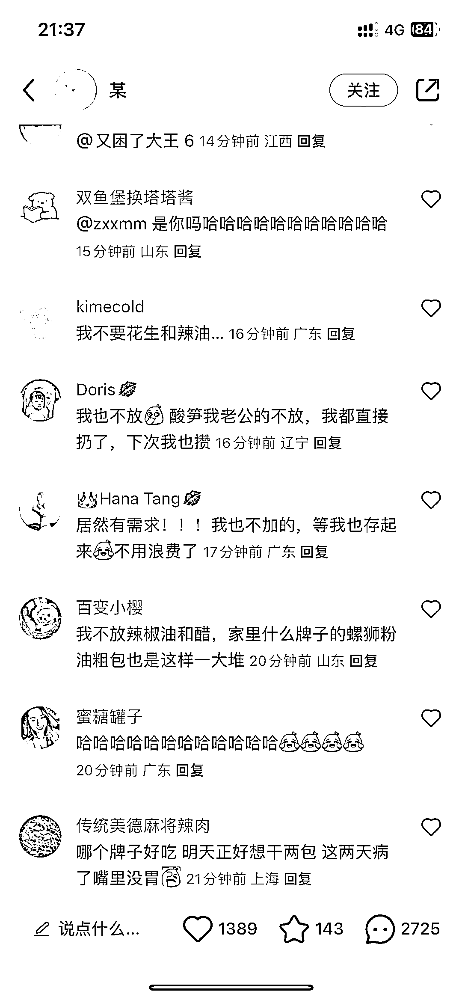

# 小红书螺蛳粉的油、酸笋等特殊味道的小东西也能引流

> 原文：[`www.yuque.com/for_lazy/xkrm14/ibqfuib7ctxxdnbz`](https://www.yuque.com/for_lazy/xkrm14/ibqfuib7ctxxdnbz)

作者： 曾丽@丽丽曾

日期：2023-03-15

点赞数：75

<ne-hole id="u8912588b" data-lake-id="u8912588b">

正文：

螺蛳粉的油、酸笋等特殊味道的小东西也能引流，建个互换或闲置群，进群要加好友，精准引流吃货用户

  <ne-p id="u8d616113" data-lake-id="u8d616113">  <ne-p id="uf74ac457" data-lake-id="uf74ac457">  <ne-p id="ucb827841" data-lake-id="ucb827841">  <ne-hole id="uef2df3f0" data-lake-id="uef2df3f0"><ne-p id="ud72898e0" data-lake-id="ud72898e0">评论区：

蓝弈 : 这太六了[捂脸]

曾丽@丽丽曾 : 我也万万没想到。居然有人囤了一两斤的调料包，1 包那么轻

💪🏻吉吉积极向上 : 是我眼拙了[皱眉]

瘦晓白 : 这下我的辣椒油有去处了[捂脸]

薇姐买房 : 我在想，是真的屯，还是单独进货的。 如果真的屯了这么多种类的调料，那是妥妥的吃货，如果 ta 有流量意识，妥妥的活该赚这个钱。 但也可能就是吃的。 但如果是进货的.....有这样的进货渠道吗？ 还是找张图摆拍而已？ 伪装为吃货去引流？

曾丽@丽丽曾 : 他没引流，就只是找个同城人卖了而已。我想到这可以引流哈哈哈

曾丽@丽丽曾 : 啊哈哈哈还有我的，我每次都不吃

<ne-hole id="u2da50053" data-lake-id="u2da50053">

公众号懒人找资源，懒人专属群分享

</ne-hole></ne-hole></ne-p></ne-p></ne-p></ne-p></ne-hole>