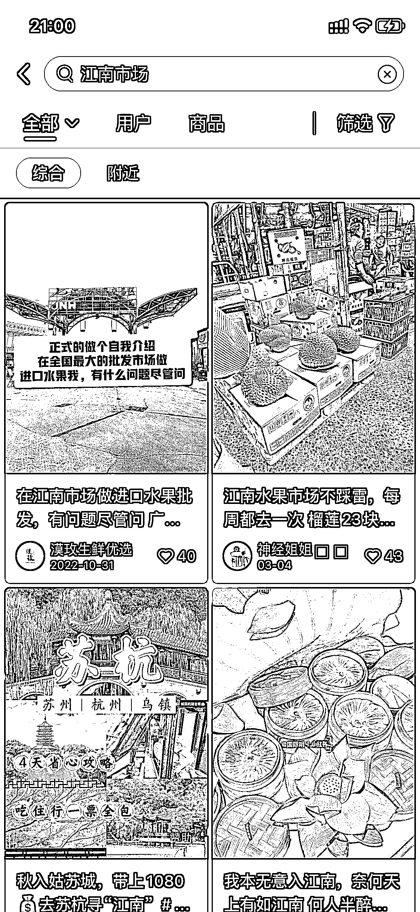
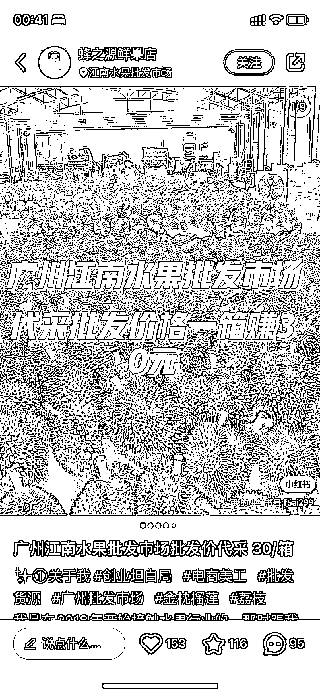

# 在小红书做水果代发生意（无货源）

> 原文：[`www.yuque.com/for_lazy/xkrm14/gx6aalgayikg9lsl`](https://www.yuque.com/for_lazy/xkrm14/gx6aalgayikg9lsl)

<ne-p id="u31dc19b0" data-lake-id="u31dc19b0"><ne-text id="u9e7d666f">作者： 麦洛</ne-text></ne-p> <ne-p id="u9b3310f6" data-lake-id="u9b3310f6"><ne-text id="uba5865e2">日期：2023-03-15</ne-text></ne-p> <ne-p id="u28707104" data-lake-id="u28707104"><ne-text id="u280cc696">点赞数：</ne-text><ne-text id="u527953a2" ne-bold="true">80</ne-text></ne-p> <ne-hole id="u99bac682" data-lake-id="u99bac682"><ne-card data-card-name="hr" data-card-type="block" id="kQowM" data-event-boundary="card"><ne-p id="u22b5f146" data-lake-id="u22b5f146"><ne-text id="u498599e0">正文：</ne-text></ne-p> <ne-p id="u53bc17c2" data-lake-id="u53bc17c2"><ne-text id="u6b0bfbdf">在小红书做水果代发生意（无货源） 背景介绍：在国内有两大水果市场：嘉兴水果市场、广州江南水果市场，在这两大水果市场可以买到超级多的高质量进口水果</ne-text> <ne-text id="u4f2b36e3">1、在小红书搜索「江南市场」、「嘉兴水果市场」、「xxx 水果」可以看到很多篇帖子，通过评论区，可以看出来大家购买意愿很强烈</ne-text> <ne-text id="u7ac798b4">2、这两大市场不对散户外零售，最低购买条件为一件（不同水果，一件的规格不一样，比如蓝莓一件是 12 盒）</ne-text> <ne-text id="u2258a4c9">3、很多用户想要购买这些进口水果，所以催生出了「代买」职业 4、代买通过收取服务费赚钱：比如蓝莓一件 220 元，职业代买收 5 元服务费，225</ne-text> <ne-text id="u0f135268">元到手（不包含邮费） 5、当然，只赚 5 元的生意是比较累的 6、我们可以通过在小红书发帖帮忙代买，220 元的蓝莓卖 270 元，客户依然会很开心</ne-text> <ne-text id="ue10b6b41">7、我们不用在水果市场，我们只需要在小红书找客户，把单子扔给真正的代买即可，赚取中间差价 这个事情赚钱吗？ 一单利润大概是单价的 30%</ne-text> <ne-text id="u2d8f8361">左右。水果不是一盒喔，是一件起卖喔，客单价在 200 ~ 无穷 水果那么贵，有人买吗？</ne-text> <ne-text id="uac10e4ee">比起零售店来说，是便宜的，并且质量是很好的，买的人一点都不少。好多个这样的水果群爆满，买起进口水果来一点不心疼，我这样的穷人一周都买了 1200</ne-text> <ne-text id="u67670cc1">多的蓝莓吃了，群里的人更甚 这个事情需要什么样的能力？ 初期：小红书笔记运营能力。中期：私域运营能力 我不在水果市场，怎么找图片，怎么找人帮我代买呢？</ne-text> <ne-text id="u687b8b73">抖音、小红书里面，找真正在市场里面的人。他们有一件代发能力，帮你买，帮你发货，你只需要找到顾客</ne-text></ne-p> <ne-p id="u7143ed35" data-lake-id="u7143ed35"><ne-card data-card-name="image" data-card-type="inline" id="JgFC2" data-event-boundary="card"></ne-card></ne-p> <ne-p id="u4e04e14f" data-lake-id="u4e04e14f"><ne-card data-card-name="image" data-card-type="inline" id="NSf9j" data-event-boundary="card"></ne-card></ne-p> <ne-hole id="ua53bf1d6" data-lake-id="ua53bf1d6"><ne-card data-card-name="hr" data-card-type="block" id="gkjxV" data-event-boundary="card"><ne-p id="u60ce9fa0" data-lake-id="u60ce9fa0"><ne-text id="u6257aaf8">评论区：</ne-text></ne-p> <ne-p id="u3ef2ba1b" data-lake-id="u3ef2ba1b"><ne-text id="u90c1414b">麦洛 : 小红书人群，质量高 进口水果，利润高，客户值得去做私域复购</ne-text></ne-p> <ne-p id="u334865d8" data-lake-id="u334865d8"><ne-text id="u1f010c67">简 : 我来嘉兴三年了，竟然不知道[捂脸]，明天就去看看</ne-text></ne-p> <ne-p id="ucc6f1f41" data-lake-id="ucc6f1f41"><ne-text id="u65ccc476">我的执着 : 去哪里找职业代买的呢</ne-text></ne-p> <ne-p id="u49a70d07" data-lake-id="u49a70d07"><ne-text id="u69a3dd3b">💪🏻吉吉积极向上 : 快去快去，我们海宁去嘉兴代购的很多，有个人做到本地团第一</ne-text></ne-p> <ne-p id="u999e5b6a" data-lake-id="u999e5b6a"><ne-text id="ubc31915e">西琪💫 : 你这个不奇怪，我家在嘉兴水果市场河对面，这个生意从来没有想过，哎哟喂！</ne-text></ne-p> <ne-p id="uaad72679" data-lake-id="uaad72679"><ne-text id="u5be4076c">彦威 : 现在入场来的急</ne-text></ne-p> <ne-p id="u8c156369" data-lake-id="u8c156369"><ne-text id="u4c32be96">咨询师欧欧 : 估计水果市场门口就有很多</ne-text></ne-p> <ne-hole id="ufa4c2db8" data-lake-id="ufa4c2db8"><ne-card data-card-name="hr" data-card-type="block" id="zQ1Kw" data-event-boundary="card"><ne-p id="u3aeaddf3" data-lake-id="u3aeaddf3"><ne-text id="u333c6ddf">公众号懒人找资源，懒人专属群分享</ne-text></ne-p></ne-card></ne-hole></ne-card></ne-hole></ne-card></ne-hole>