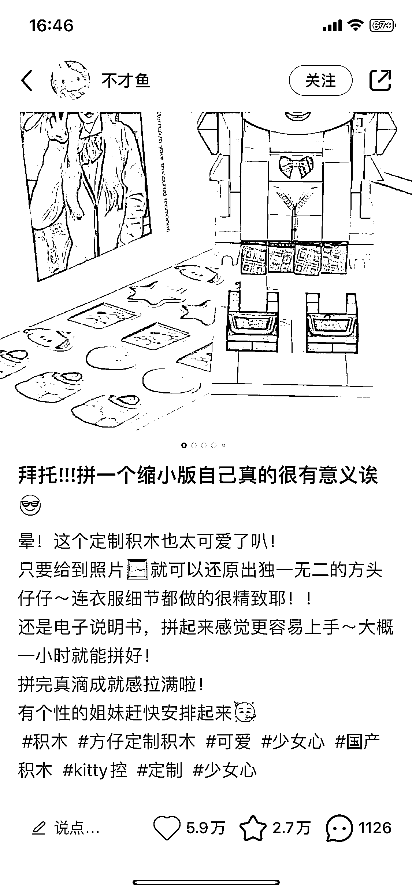
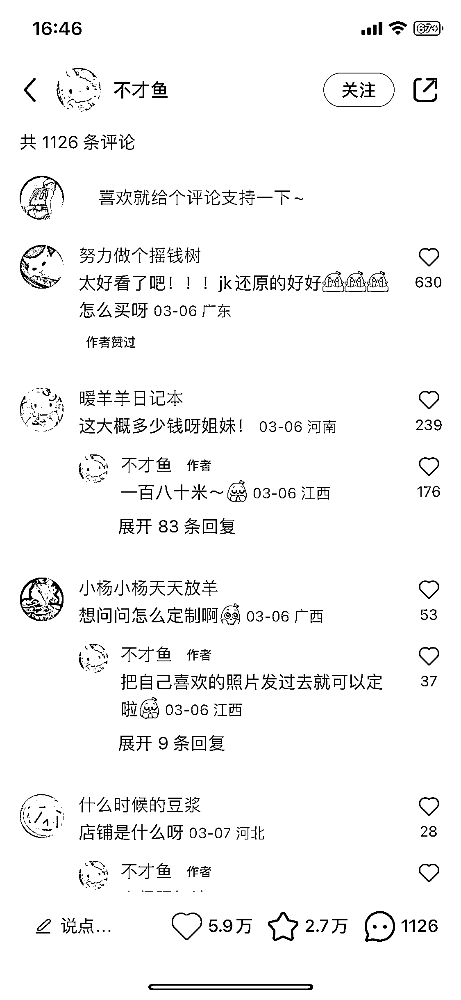
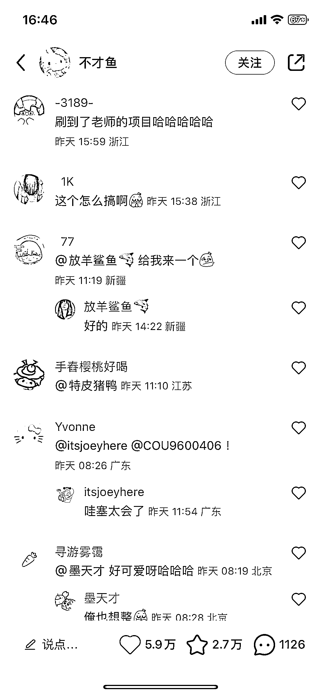

# 小红书根据客户照片定制积木

> 原文：[`www.yuque.com/for_lazy/xkrm14/mkzeqaoflwk3gqg7`](https://www.yuque.com/for_lazy/xkrm14/mkzeqaoflwk3gqg7)

作者： 浅色 8ug 的喵

日期：2023-03-15

点赞数：45

<ne-hole id="uec58f267" data-lake-id="uec58f267"><ne-card data-card-name="hr" data-card-type="block" id="oRaXy" data-event-boundary="card">

正文：

根据客户照片定制积木 之前也见到过类似的，比如城市建筑、景点地标、明星、影视角色等等做出来的定制产品 这种的算是定制服务 2.0 结合 AI 绘画 发展空间很大 评论区很多询问如何定制

<ne-card data-card-name="image" data-card-type="inline" id="EVSqA" data-event-boundary="card">  <ne-p id="uef98a8d1" data-lake-id="uef98a8d1"><ne-card data-card-name="image" data-card-type="inline" id="OR2q6" data-event-boundary="card">  <ne-p id="ub70ba95b" data-lake-id="ub70ba95b"><ne-card data-card-name="image" data-card-type="inline" id="gIpnR" data-event-boundary="card">  <ne-p id="u99410844" data-lake-id="u99410844"><ne-card data-card-name="image" data-card-type="inline" id="NoJQh" data-event-boundary="card">  <ne-hole id="u07bd78a5" data-lake-id="u07bd78a5"><ne-card data-card-name="hr" data-card-type="block" id="asEnA" data-event-boundary="card"><ne-p id="ue45f26e6" data-lake-id="ue45f26e6">评论区：

刘岩涛 : 方仔照相馆？竟然是一个 2020 年就有了的项目

<ne-hole id="uaecf6c93" data-lake-id="uaecf6c93"><ne-card data-card-name="hr" data-card-type="block" id="CLTAv" data-event-boundary="card">

公众号懒人找资源，懒人专属群分享

</ne-card></ne-hole></ne-card></ne-hole></ne-card></ne-p></ne-card></ne-p></ne-card></ne-p></ne-card></ne-p></ne-card></ne-hole>