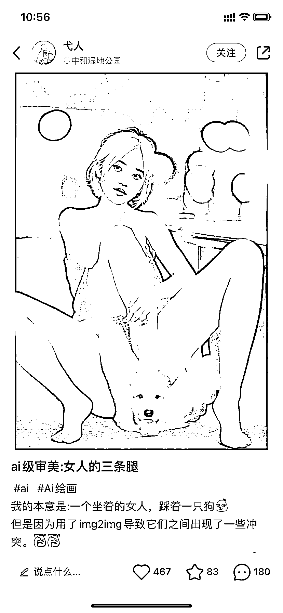

# 小红书以失败的 AI 作品为话题发图文，流量很高

> 原文：[`www.yuque.com/for_lazy/xkrm14/qm799ww5cahx0ear`](https://www.yuque.com/for_lazy/xkrm14/qm799ww5cahx0ear)

作者： 太波

日期：2023-03-15

点赞数：40

正文：

以失败的 ai 作品为话题，发图文，有槽点，话题性很高，后面结合自己成功的案例，有对比，有反差，可以增加信任感，方便变现

  

评论区：

公众号懒人找资源，懒人专属群分享

