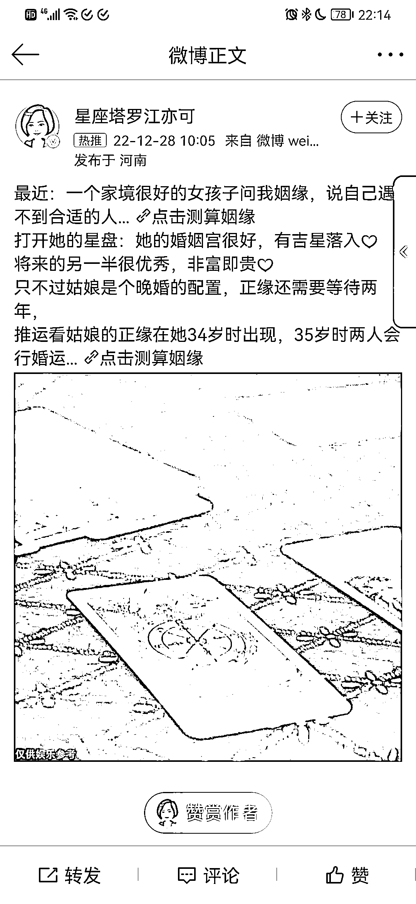
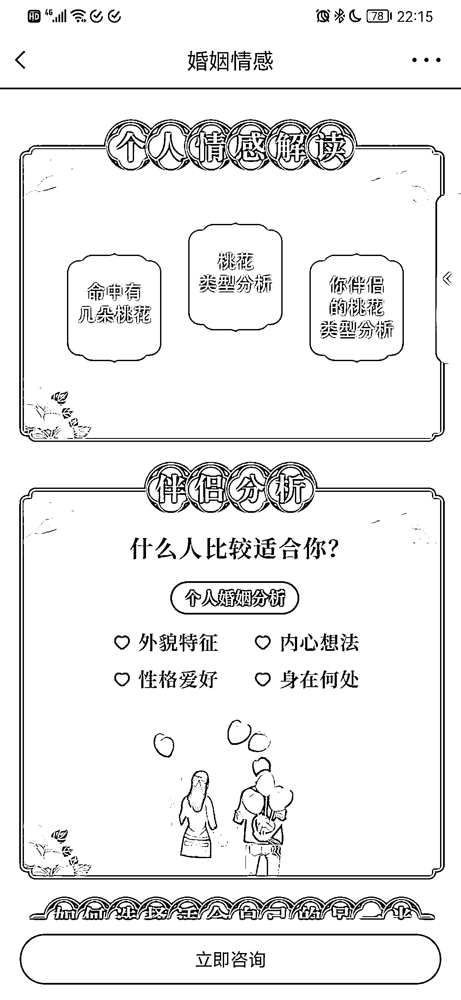
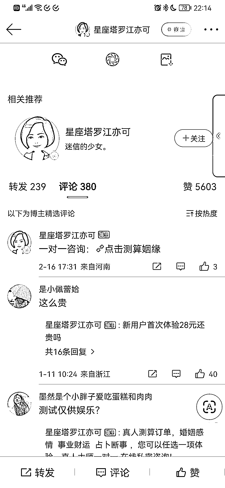

# 微博付费推广，没预算也可模仿的操作思路

> 原文：[`www.yuque.com/for_lazy/xkrm14/wd7xgozyzoe9x3wv`](https://www.yuque.com/for_lazy/xkrm14/wd7xgozyzoe9x3wv)

<ne-p id="u5f2bbd72" data-lake-id="u5f2bbd72"><ne-text id="u97cb7ed9">作者： 陈龙</ne-text></ne-p> <ne-p id="u2c7e6759" data-lake-id="u2c7e6759"><ne-text id="uef439718">日期：2023-03-14</ne-text></ne-p> <ne-p id="u75b61cec" data-lake-id="u75b61cec"><ne-text id="u20b6a59c">点赞数：</ne-text><ne-text id="ubff3e56a" ne-bold="true">31</ne-text></ne-p> <ne-hole id="ub5190078" data-lake-id="ub5190078"><ne-card data-card-name="hr" data-card-type="block" id="TouzL" data-event-boundary="card"><ne-p id="ucaa57553" data-lake-id="ucaa57553"><ne-text id="u44f2f765">正文：</ne-text></ne-p> <ne-p id="u58306446" data-lake-id="u58306446"><ne-text id="ua8508085">微博的付费推广，我们没有预算的也可以模仿 亦仁老大说过，但凡是能够付费去推广的广告，都是能赚钱的 当我们没有这么多预算去付费广告的时候</ne-text> <ne-text id="u16a4ae9b">也可以去模仿，模仿他的内容，然后发在公域上去引流 虽然效果没有付费推广这么好，但是咱这是免费的流量 微博能火，那么小红书，抖音也能火</ne-text> <ne-text id="u9c262843">只要是爆款过的内容，就更容易出爆款 只要把里面的素材换成图文，就可以很容易的发布了 配合我们这次 ai 绘画航海的教程来，足够用了</ne-text></ne-p> <ne-p id="u7cd8656b" data-lake-id="u7cd8656b"><ne-card data-card-name="image" data-card-type="inline" id="H8IsE" data-event-boundary="card">  <ne-p id="uf2aaae95" data-lake-id="uf2aaae95"><ne-card data-card-name="image" data-card-type="inline" id="Nnay7" data-event-boundary="card">  <ne-p id="u40d2cefd" data-lake-id="u40d2cefd"><ne-card data-card-name="image" data-card-type="inline" id="yNQM9" data-event-boundary="card">  <ne-p id="u714f5cc8" data-lake-id="u714f5cc8"><ne-card data-card-name="image" data-card-type="inline" id="O9xHl" data-event-boundary="card">  <ne-hole id="u755abbda" data-lake-id="u755abbda"><ne-card data-card-name="hr" data-card-type="block" id="uv5NX" data-event-boundary="card"><ne-p id="ub5cef64a" data-lake-id="ub5cef64a"><ne-text id="uc9a181c3">评论区：</ne-text></ne-p> <ne-p id="u403f0da3" data-lake-id="u403f0da3"><ne-text id="u43f77a9d">卓桐 : 万事难决，唯有玄学[皱眉]</ne-text></ne-p> <ne-p id="u2333bf4c" data-lake-id="u2333bf4c"><ne-text id="uc68b0c54">陈龙 : 宇宙的尽头是编制，科学的尽头是玄学[呲牙]</ne-text></ne-p> <ne-hole id="uabf14021" data-lake-id="uabf14021"><ne-card data-card-name="hr" data-card-type="block" id="RYUX9" data-event-boundary="card"><ne-p id="uacb2364d" data-lake-id="uacb2364d"><ne-text id="u986fe458">公众号懒人找资源，懒人专属群分享</ne-text></ne-p></ne-card></ne-hole></ne-card></ne-hole></ne-card></ne-p></ne-card></ne-p></ne-card></ne-p></ne-card></ne-p></ne-card></ne-hole>