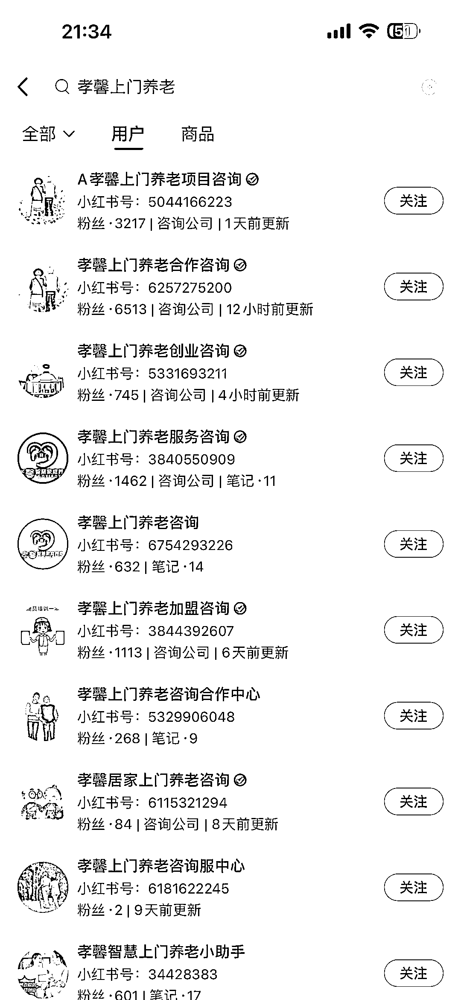

# 小红书的上门养老矩阵，引流私域做加盟

> 原文：[`www.yuque.com/for_lazy/xkrm14/rcfspwwg8g4kf1hd`](https://www.yuque.com/for_lazy/xkrm14/rcfspwwg8g4kf1hd)

<ne-p id="u8d1690cf" data-lake-id="u8d1690cf"><ne-text id="ua8f73cb3">作者： 斑马森林</ne-text></ne-p> <ne-p id="ud4acf2e5" data-lake-id="ud4acf2e5"><ne-text id="u17f2a700">日期：2023-03-14</ne-text></ne-p> <ne-p id="ucbb5ce76" data-lake-id="ucbb5ce76"><ne-text id="u46253777">点赞数：</ne-text><ne-text id="uec8767d8" ne-bold="true">39</ne-text></ne-p> <ne-hole id="u069941fb" data-lake-id="u069941fb"><ne-card data-card-name="hr" data-card-type="block" id="UfSYE" data-event-boundary="card"><ne-p id="u476c4197" data-lake-id="u476c4197"><ne-text id="u6aefa0f3">正文：</ne-text></ne-p> <ne-p id="ua005101f" data-lake-id="ua005101f"><ne-text id="u688cc5e3">小红书上的上门养老矩阵 笔记内容主要是项目介绍 吸引用户加盟卖培训</ne-text></ne-p> <ne-p id="uc404f918" data-lake-id="uc404f918"><ne-card data-card-name="image" data-card-type="inline" id="pu0mF" data-event-boundary="card">  <ne-p id="u6bf5420e" data-lake-id="u6bf5420e"><ne-card data-card-name="image" data-card-type="inline" id="BofUj" data-event-boundary="card">  <ne-p id="u93c4f666" data-lake-id="u93c4f666"><ne-card data-card-name="image" data-card-type="inline" id="wgtIs" data-event-boundary="card">  <ne-p id="ua07ec4a2" data-lake-id="ua07ec4a2"><ne-card data-card-name="image" data-card-type="inline" id="c09sG" data-event-boundary="card">  <ne-hole id="u6b1bfebb" data-lake-id="u6b1bfebb"><ne-card data-card-name="hr" data-card-type="block" id="G67Na" data-event-boundary="card"><ne-p id="u06cba219" data-lake-id="u06cba219"><ne-text id="u6dab548a">评论区：</ne-text></ne-p> <ne-p id="u013fa7b9" data-lake-id="u013fa7b9"><ne-text id="u5e3358fd">高杰 : 这个确实做得好，我都加过，就是招商加盟</ne-text></ne-p> <ne-p id="uf04493a3" data-lake-id="uf04493a3"><ne-text id="u3b065ea6">波叔 : 这个做得很厉害，银发经济</ne-text></ne-p> <ne-p id="u0de285b9" data-lake-id="u0de285b9"><ne-text id="u8ba0ad08">向暖儿 : 我刷到好几次了，很感兴趣，差点就花钱加盟了，话说这个好做吗</ne-text></ne-p> <ne-p id="u65ad0106" data-lake-id="u65ad0106"><ne-text id="u332ceb8c">苏生 : 这种图画是怎么生成的呢</ne-text></ne-p> <ne-p id="ubb5e47fb" data-lake-id="ubb5e47fb"><ne-text id="u01da3f05">惠子 : 怎么样？好做么~</ne-text></ne-p> <ne-p id="u4b9698e1" data-lake-id="u4b9698e1"><ne-text id="u0e85d630">Polar : 重复的风向标了吧。</ne-text>[<ne-text id="ucef6a842">知识星球+|+深度连接铁杆粉丝，运营高品质社群，知识变现的工具</ne-text>](https://wx.zsxq.com/dweb2/index/topic_detail/181512845858542)</ne-p> <ne-hole id="u1ec31fad" data-lake-id="u1ec31fad"><ne-card data-card-name="hr" data-card-type="block" id="vvsPC" data-event-boundary="card"><ne-p id="uc680ec37" data-lake-id="uc680ec37"><ne-text id="ub486e87f">公众号懒人找资源，懒人专属群分享</ne-text></ne-p></ne-card></ne-hole></ne-card></ne-hole></ne-card></ne-p></ne-card></ne-p></ne-card></ne-p></ne-card></ne-p></ne-card></ne-hole>