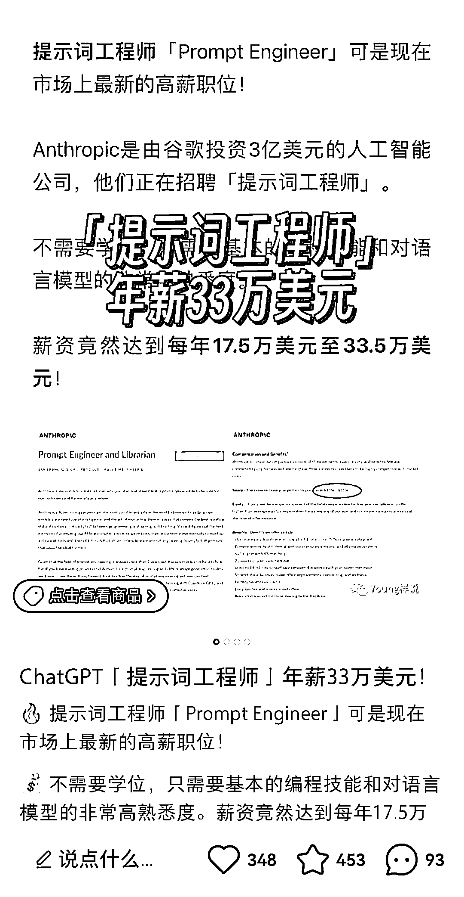

# 小红书资料引流，发布程序员高薪信息

> 原文：[`www.yuque.com/for_lazy/xkrm14/ggyhyy5z5ymxvb2e`](https://www.yuque.com/for_lazy/xkrm14/ggyhyy5z5ymxvb2e)

<ne-p id="u53f680e8" data-lake-id="u53f680e8"><ne-text id="u300fa4a1">作者： hedy</ne-text></ne-p> <ne-p id="ud84b5604" data-lake-id="ud84b5604"><ne-text id="ub00929f6">日期：2023-03-14</ne-text></ne-p> <ne-p id="u033e65b9" data-lake-id="u033e65b9"><ne-text id="u4197fecb">点赞数：</ne-text><ne-text id="u3e673e59" ne-bold="true">23</ne-text></ne-p> <ne-hole id="u3215998a" data-lake-id="u3215998a"><ne-card data-card-name="hr" data-card-type="block" id="eGlOU" data-event-boundary="card"><ne-p id="uae893191" data-lake-id="uae893191"><ne-text id="u2ab3f1f5">正文：</ne-text></ne-p> <ne-p id="u36a6a890" data-lake-id="u36a6a890"><ne-text id="ufcaa8778">提示词工程师年薪 33 万美元~ 小红书上刷到的一篇笔记，程序员们可以关注起来~</ne-text> <ne-text id="ua246a147">这条笔记通过分享这一个信息后，最后以资料的形式引流到私域，评论区很多都是求学习资料，想通过 chatgpt 变现引流的也可以学起来~</ne-text></ne-p> <ne-p id="u9e758b90" data-lake-id="u9e758b90"><ne-card data-card-name="image" data-card-type="inline" id="mdHQZ" data-event-boundary="card">  <ne-hole id="ubd8dc4b2" data-lake-id="ubd8dc4b2"><ne-card data-card-name="hr" data-card-type="block" id="S8uvm" data-event-boundary="card"><ne-p id="ucf3c6e7b" data-lake-id="ucf3c6e7b"><ne-text id="ue27dd456">评论区：</ne-text></ne-p> <ne-p id="u8884773e" data-lake-id="u8884773e"><ne-text id="ua7889373">奶爸超人 : 这都可以，这条消息早就知道了，但就是没脑子想到用这个消息当钩子。。。</ne-text></ne-p> <ne-p id="ubddeebd7" data-lake-id="ubddeebd7"><ne-text id="u6a71e5f6">hedy : 用起来[偷笑][偷笑]</ne-text></ne-p> <ne-p id="ued9f18dc" data-lake-id="ued9f18dc"><ne-text id="u022f0020">奶爸超人 : 嗯嗯，很受启发</ne-text></ne-p> <ne-hole id="u4596b074" data-lake-id="u4596b074"><ne-card data-card-name="hr" data-card-type="block" id="rhTnA" data-event-boundary="card"><ne-p id="ufd59ded1" data-lake-id="ufd59ded1"><ne-text id="u38d7a5ae">公众号懒人找资源，懒人专属群分享</ne-text></ne-p></ne-card></ne-hole></ne-card></ne-hole></ne-card></ne-p></ne-card></ne-hole>