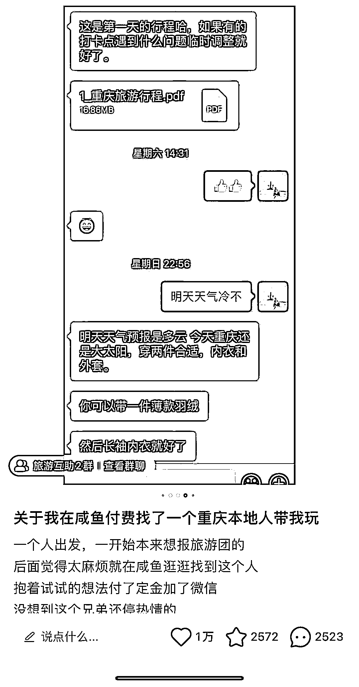

# 小红书笔记，一人一个私藏旅游攻略笔记，引流私域变现

> 原文：[`www.yuque.com/for_lazy/xkrm14/sl43a1g4k5siwn8w`](https://www.yuque.com/for_lazy/xkrm14/sl43a1g4k5siwn8w)

<ne-p id="uea30aa9f" data-lake-id="uea30aa9f"><ne-text id="u8cca0fa4">作者： 猪识帽</ne-text></ne-p> <ne-p id="u4f53a988" data-lake-id="u4f53a988"><ne-text id="u5ff850f6">日期：2023-03-14</ne-text></ne-p> <ne-p id="u8c48310f" data-lake-id="u8c48310f"><ne-text id="u00c7eb73">点赞数：</ne-text><ne-text id="u479cdb4b" ne-bold="true">18</ne-text></ne-p> <ne-hole id="u74aa2f87" data-lake-id="u74aa2f87"><ne-card data-card-name="hr" data-card-type="block" id="NsxuU" data-event-boundary="card"><ne-p id="ub1afe9ec" data-lake-id="ub1afe9ec"><ne-text id="u76eb4d6f">正文：</ne-text></ne-p> <ne-p id="u9bbdf65f" data-lake-id="u9bbdf65f"><ne-text id="u1c7c5486">小红书笔记，在闲鱼找重庆本地人带玩。异常值是这篇笔记点赞一万，看起来还是有用户需求的。这篇笔记的博主建立了小红书群，还在评论区留下钩子互动，或许可以尝试引流私域。出单之后可以尝试慢慢搭建个人 ip。</ne-text> <ne-text id="ud919fbbf">另外，发笔记“一人一个私藏旅游攻略”卖各地旅游攻略可能也是个变现的方式。</ne-text></ne-p> <ne-p id="u8da4e281" data-lake-id="u8da4e281"><ne-card data-card-name="image" data-card-type="inline" id="dDOuv" data-event-boundary="card"></ne-card></ne-p> <ne-p id="ucdbdc4dd" data-lake-id="ucdbdc4dd"><ne-card data-card-name="image" data-card-type="inline" id="HnAbe" data-event-boundary="card"></ne-card></ne-p> <ne-p id="u24599123" data-lake-id="u24599123"><ne-card data-card-name="image" data-card-type="inline" id="g2fUn" data-event-boundary="card"></ne-card></ne-p> <ne-hole id="ua65ff2da" data-lake-id="ua65ff2da"><ne-card data-card-name="hr" data-card-type="block" id="WJpRc" data-event-boundary="card"><ne-p id="u9b710e52" data-lake-id="u9b710e52"><ne-text id="u3fb0ab4b">评论区：</ne-text></ne-p> <ne-hole id="ud14eaad5" data-lake-id="ud14eaad5"><ne-card data-card-name="hr" data-card-type="block" id="M8CWO" data-event-boundary="card"><ne-p id="u95d34ab3" data-lake-id="u95d34ab3"><ne-text id="u4f524d10">公众号懒人找资源，懒人专属群分享</ne-text></ne-p></ne-card></ne-hole></ne-card></ne-hole></ne-card></ne-hole>