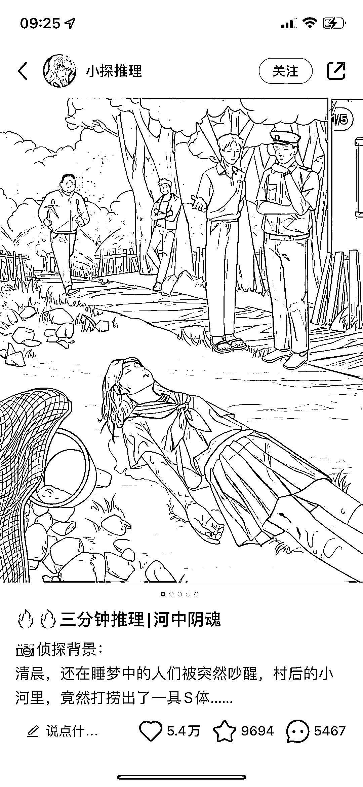
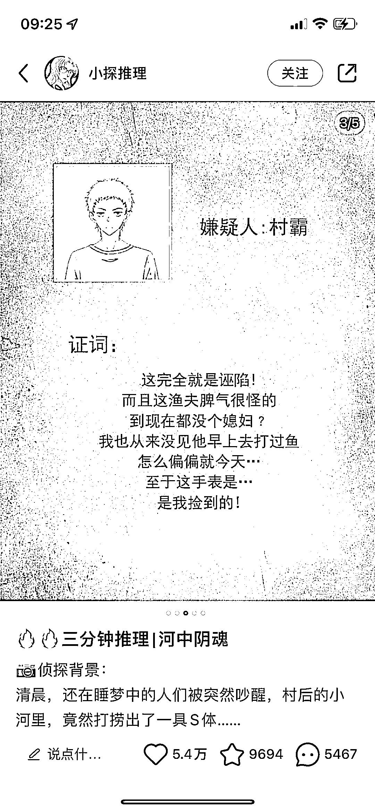

# 小红书用 AI 生成小说推理

> 原文：[`www.yuque.com/for_lazy/xkrm14/kmgzucfugfvr86yq`](https://www.yuque.com/for_lazy/xkrm14/kmgzucfugfvr86yq)

作者： some123

日期：2023-03-14

点赞数：31

正文：

可以用 AI 生成小说推理，剧情推理，流量还不错，可以植入广告变现

  <ne-p id="u171f7e0e" data-lake-id="u171f7e0e">  <ne-p id="ubcae91c8" data-lake-id="ubcae91c8">  <ne-p id="u1d78a237" data-lake-id="u1d78a237">评论区：

xing : 发表在哪里

春秋 : 小红书

公众号懒人找资源，懒人专属群分享

</ne-p></ne-p></ne-p>