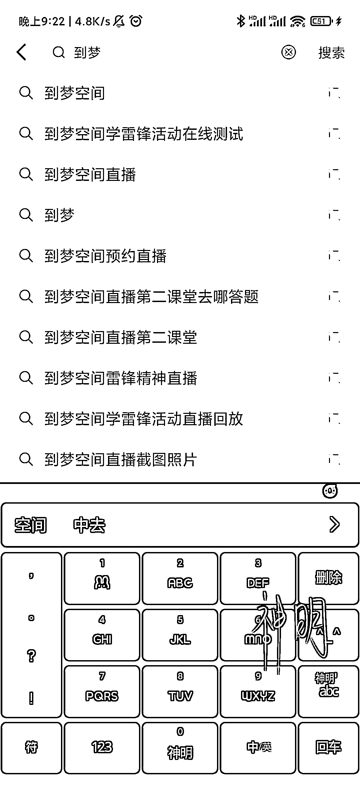
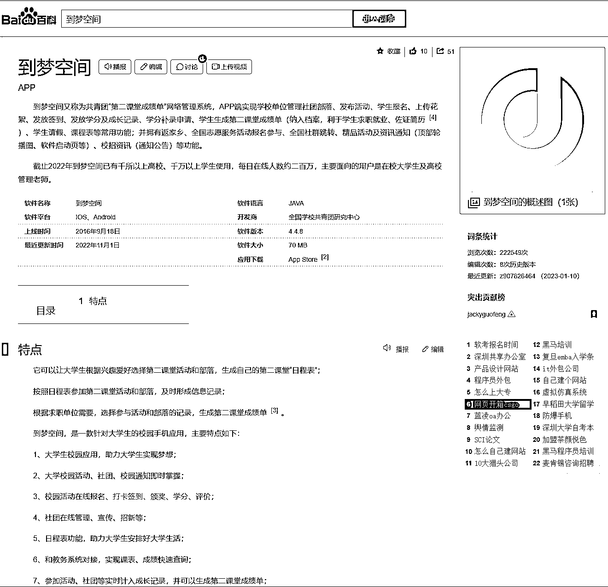

# 到梦空间，大学生管理系统，可引流大学生粉

> 原文：[`www.yuque.com/for_lazy/xkrm14/luhxzdnvbnvlzzrf`](https://www.yuque.com/for_lazy/xkrm14/luhxzdnvbnvlzzrf)

<ne-p id="ufbf8fd73" data-lake-id="ufbf8fd73"><ne-text id="u2ca9cf7e">作者： 七小</ne-text></ne-p> <ne-p id="ufb64e57a" data-lake-id="ufb64e57a"><ne-text id="u461128b2">日期：2023-03-13</ne-text></ne-p> <ne-p id="u84e634fe" data-lake-id="u84e634fe"><ne-text id="u045f65b6">点赞数：</ne-text><ne-text id="u2b324b57" ne-bold="true">50</ne-text></ne-p> <ne-hole id="u2d183fa4" data-lake-id="u2d183fa4"><ne-card data-card-name="hr" data-card-type="block" id="v0Hiw" data-event-boundary="card"><ne-p id="u72733c75" data-lake-id="u72733c75"><ne-text id="ud6d19811">正文：</ne-text></ne-p> <ne-p id="u2d015934" data-lake-id="u2d015934"><ne-text id="ufb506bd1">1.发现了一个奇怪的词【到梦空间】，搜索指数还挺高。月搜索人次 60w+，近期暴涨。 2.去搜了一下，发现它是大学校园学生管理系统的 app</ne-text> <ne-text id="u31fe3bbd">3.在抖音上搜这个词，发现一条内容，放的是【直播截图】，评论转发挺高，是异常值 4.打开评论区，很多人都在求图，说保存不了。 梳理之后发现逻辑是这样：</ne-text> <ne-text id="u7329754f">1.这是个大学生管理系统，估计是学校要求学生去参加直播，还要截图证明，以此考核学分？ 很多学生没到场参加，为了给学校交差，事后来求图。</ne-text> <ne-text id="ue607f587">2.从中发现的机会是：引流大学生粉，除了学习资料引流，还可以用这类【考核/给学校交差需要的证明】，来引流。</ne-text> <ne-text id="u235003d7">再搭配一些大学生公共课的资料，可以来做网盘拉新项目了。</ne-text></ne-p> <ne-p id="uc9880a38" data-lake-id="uc9880a38"><ne-card data-card-name="image" data-card-type="inline" id="wVCJu" data-event-boundary="card">  <ne-p id="u7295f40e" data-lake-id="u7295f40e"><ne-card data-card-name="image" data-card-type="inline" id="mkVwT" data-event-boundary="card">  <ne-p id="uc48ee3a0" data-lake-id="uc48ee3a0"><ne-card data-card-name="image" data-card-type="inline" id="VU8Pb" data-event-boundary="card">  <ne-p id="u0df30088" data-lake-id="u0df30088"><ne-card data-card-name="image" data-card-type="inline" id="CbVFi" data-event-boundary="card">  <ne-hole id="ud1530bc1" data-lake-id="ud1530bc1"><ne-card data-card-name="hr" data-card-type="block" id="ECs6e" data-event-boundary="card"><ne-p id="u8176cd27" data-lake-id="u8176cd27"><ne-text id="ua0f211f9">评论区：</ne-text></ne-p> <ne-p id="uc2c7be94" data-lake-id="uc2c7be94"><ne-text id="u0d7144ea">潮州痞子蔡 : 划重点：这个词怎么发现的？</ne-text></ne-p> <ne-p id="ub314e1be" data-lake-id="ub314e1be"><ne-text id="u04b5514e">七小 : 小程序 极客增长 暴涨词</ne-text></ne-p> <ne-p id="u7522e3ac" data-lake-id="u7522e3ac"><ne-text id="u7665a786">潮州痞子蔡 : 这个我刚才查了一下，实际这个校园的项目是共青团主导的，类似成人版的“学习强国”，至于引流方面慎重，毕竟涉及 ZZ</ne-text></ne-p> <ne-p id="uc7d4415b" data-lake-id="uc7d4415b"><ne-text id="u7a18162a">七小 : 有道理，谢谢提醒</ne-text></ne-p> <ne-p id="u57f5cab1" data-lake-id="u57f5cab1"><ne-text id="u36558ac8">一尘学长 : 这个属于大学生二课</ne-text> <ne-text id="u83883bd6">基本上都是学生课余活动，会给学时，但是报名名额有限，或者报名了不去，就需要这种图去打卡，但是这种打卡一般会设置范围，如果能引流，可以引流精准的某个大学的学生流量。</ne-text> <ne-text id="ue0a6f430">目前本科 4 年要修够 128 个学时，专科 64 个学时。</ne-text></ne-p> <ne-p id="ue9a27bde" data-lake-id="ue9a27bde"><ne-text id="u29b8fc2f">薇姐买房 : 赞发现过程 探索过程</ne-text></ne-p> <ne-hole id="u0d480ed1" data-lake-id="u0d480ed1"><ne-card data-card-name="hr" data-card-type="block" id="RIcaD" data-event-boundary="card"><ne-p id="ubfb6592c" data-lake-id="ubfb6592c"><ne-text id="ud66d3706">公众号懒人找资源，懒人专属群分享</ne-text></ne-p></ne-card></ne-hole></ne-card></ne-hole></ne-card></ne-p></ne-card></ne-p></ne-card></ne-p></ne-card></ne-p></ne-card></ne-hole>