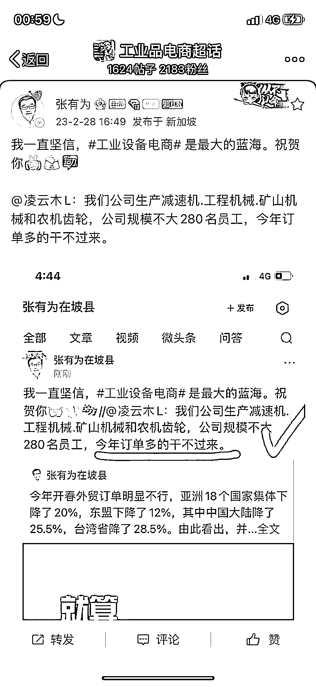

# 微博做工业设备电商，普通人可长期做

> 原文：[`www.yuque.com/for_lazy/xkrm14/hcahxflk92y6bxc9`](https://www.yuque.com/for_lazy/xkrm14/hcahxflk92y6bxc9)

作者： 在路上

日期：2023-03-13

点赞数：22

正文：

普通人可长期做的实体➕互联网项目：工业设备电商 优势：线上引流，线下成交。大多数实体老板和销售，对互联网营销不擅长，利用好互联网引流，长期积累，养活自己足够。 有一定门槛，要学习半年或者一年，懂产品知识。有门槛是好事，不像消费品人人都可以进入，竞争太大了。 做一个细分领域的网红，也是不错的。

  

评论区：

彦威 : 这个是如何做，怎么学习？

在路上 : 实体行业 先去上半年班[微笑]

在路上 : 谢谢🙏

公众号懒人找资源，懒人专属群分享

