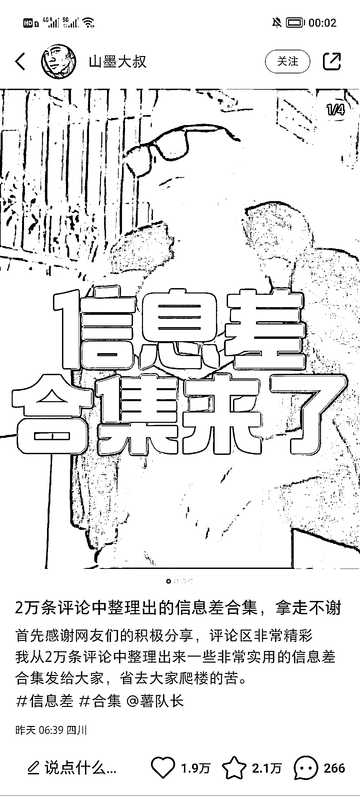
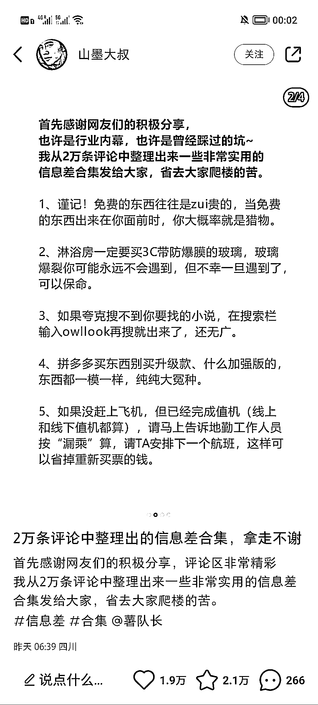

# 小红书信息差合集笔记

> 原文：[`www.yuque.com/for_lazy/xkrm14/bf5zbe6ntezy36u3`](https://www.yuque.com/for_lazy/xkrm14/bf5zbe6ntezy36u3)

作者： 米笠

日期：2023-03-13

点赞数：14

正文：

小红书信息差合集笔记 上个月很火的一人一个信息差笔记 最近很多人发，流量变差了 主要是粉丝见得多了，参与感变低了。 把内容重新调整下，整理信息差合集 精选几十个信息差，引导粉丝参与讨论 互动数据又回来了 依然可以精准引流创业粉 或者整理不同的合集内容，引流相应的粉丝群体。

  <ne-p id="u3cbcb291" data-lake-id="u3cbcb291">  <ne-p id="uedfadf7b" data-lake-id="uedfadf7b">  <ne-p id="udc1eefb9" data-lake-id="udc1eefb9">评论区：

公众号懒人找资源，懒人专属群分享

</ne-p></ne-p></ne-p>