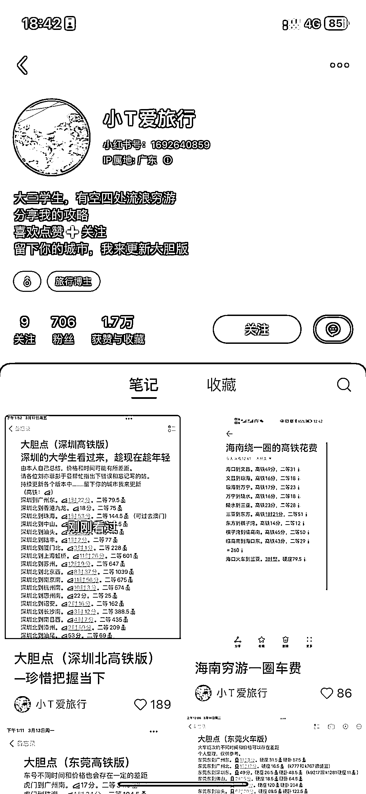
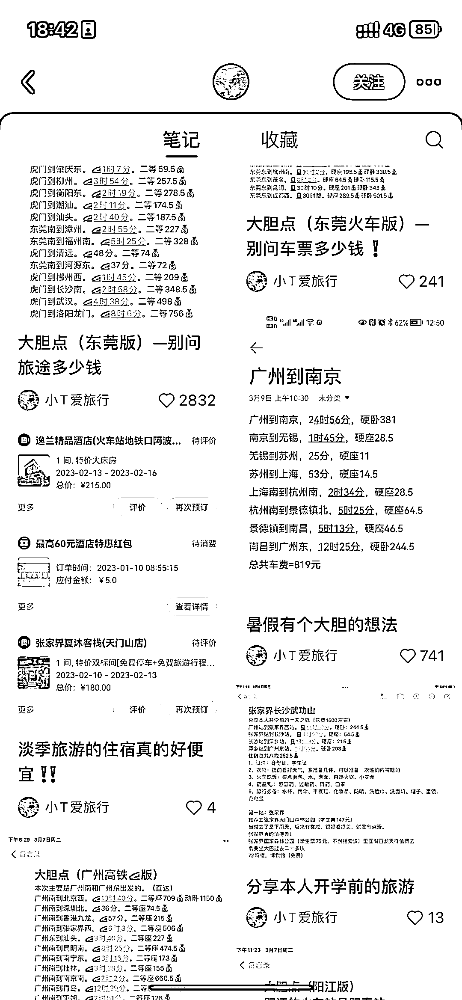

# 小红书定位大学生发从城市出发旅游高铁时间合集，互动数据好

> 原文：[`www.yuque.com/for_lazy/xkrm14/ad5e0ysd54s5dqlq`](https://www.yuque.com/for_lazy/xkrm14/ad5e0ysd54s5dqlq)

作者： 曾丽@丽丽曾

日期：2023-03-17

点赞数：99

<ne-hole id="uba348139" data-lake-id="uba348139"><ne-card data-card-name="hr" data-card-type="block" id="AGwME" data-event-boundary="card">

正文：

以某个城市为出发点，在 发旅游高铁时间合集，容易爆。 小细节：定位选 xx 大学或 xxxx 学院。

<ne-card data-card-name="image" data-card-type="inline" id="k7nX4" data-event-boundary="card">  <ne-p id="u3c6086e7" data-lake-id="u3c6086e7"><ne-card data-card-name="image" data-card-type="inline" id="f6uTu" data-event-boundary="card">  <ne-p id="u8f896609" data-lake-id="u8f896609"><ne-card data-card-name="image" data-card-type="inline" id="Nm5ou" data-event-boundary="card">  <ne-p id="u708520bc" data-lake-id="u708520bc"><ne-card data-card-name="image" data-card-type="inline" id="av3eQ" data-event-boundary="card"></ne-card>

<ne-card data-card-name="image" data-card-type="inline" id="ScKRQ" data-event-boundary="card"></ne-card>

<ne-card data-card-name="image" data-card-type="inline" id="TCgUQ" data-event-boundary="card"></ne-card>

<ne-hole id="u4f74ee6f" data-lake-id="u4f74ee6f"><ne-card data-card-name="hr" data-card-type="block" id="B3w2N" data-event-boundary="card">

评论区：

苏苏李 : 如何变现呢

花满楼 : 怎么变现

土豆君 : 变现有方法，吸引的都是旅游人群，可以通过资料引流比如各地高铁时间最全合集资料引流到微信，再通过旅游产品变现，比如提供比携程等 app 更便宜的酒店、景点门票订购等。

高建中-扬州-婚礼庆* : 想不通，为啥爆，这些网上一搜不就出来了吗？

高建中-扬州-婚礼庆* : 变现估计就是旅游景点酒店等分销，还有纪念品等周边吧

芳小姐 : 懒人经济，有些人连搜索都懒得搜。有人整理出来，一目了然，省去自己搜索整理总结的时间。

爱吃鱼的猫 : 但却愿意在小红书上搜，也是让人想笑

高建中-扬州-婚礼庆* : 好吧

<ne-hole id="u68f42049" data-lake-id="u68f42049"><ne-card data-card-name="hr" data-card-type="block" id="qxO11" data-event-boundary="card">

公众号懒人找资源，懒人专属群分享

</ne-card></ne-hole></ne-card></ne-hole></ne-card></ne-p></ne-card></ne-p></ne-card></ne-p></ne-card></ne-hole>