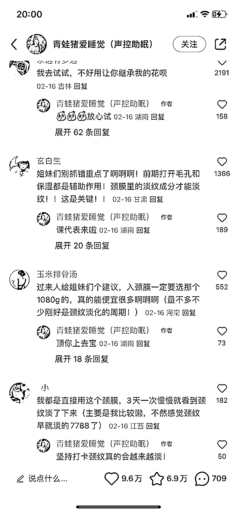
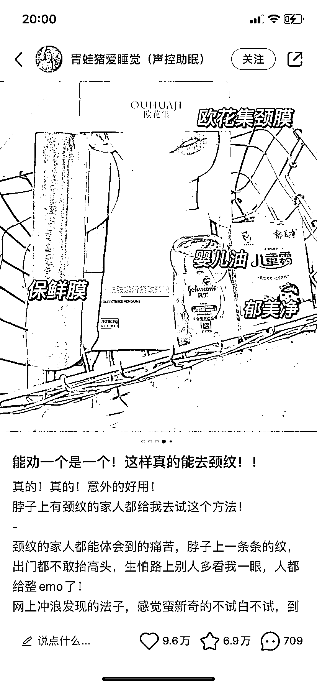
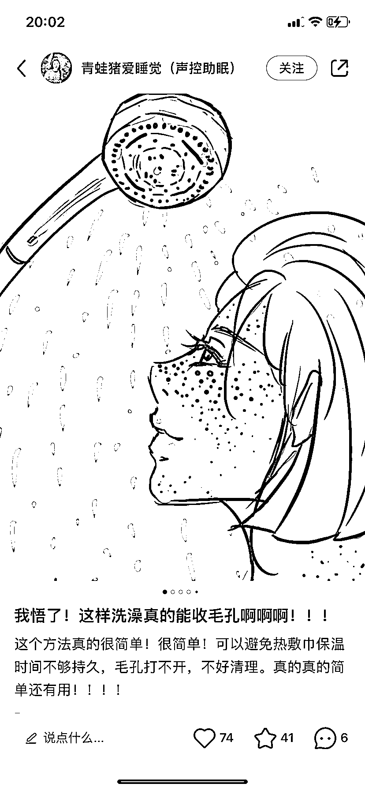

# 小红书笔记封面，可以采用针对用户痛点的漫画形式

> 原文：[`www.yuque.com/for_lazy/xkrm14/zku4mh4g306lx9bc`](https://www.yuque.com/for_lazy/xkrm14/zku4mh4g306lx9bc)

作者： 胡先森

日期：2023-03-17

点赞数：71

<ne-hole id="ufe9f3318" data-lake-id="ufe9f3318"><ne-card data-card-name="hr" data-card-type="block" id="sxrWl" data-event-boundary="card">

正文：

小红书笔记可以参考下面这种封面针对用户痛点的漫画形式（画面吸引+好奇的感的标题）。

<ne-card data-card-name="image" data-card-type="inline" id="YTSvg" data-event-boundary="card"></ne-card>

<ne-card data-card-name="image" data-card-type="inline" id="lIZyX" data-event-boundary="card"></ne-card>

<ne-card data-card-name="image" data-card-type="inline" id="GigSQ" data-event-boundary="card">  <ne-p id="ue0af5b47" data-lake-id="ue0af5b47"><ne-card data-card-name="image" data-card-type="inline" id="m0GYV" data-event-boundary="card"></ne-card>

<ne-hole id="u1c3a72a1" data-lake-id="u1c3a72a1"><ne-card data-card-name="hr" data-card-type="block" id="kAPYY" data-event-boundary="card">

评论区：

陈田 : 这种封面怎么制作

HRJ : 同问

胡先森 : 手绘的吧？

<ne-hole id="ua3fbbaee" data-lake-id="ua3fbbaee"><ne-card data-card-name="hr" data-card-type="block" id="mf91Q" data-event-boundary="card">

公众号懒人找资源，懒人专属群分享

</ne-card></ne-hole></ne-card></ne-hole></ne-card></ne-p></ne-card></ne-hole>