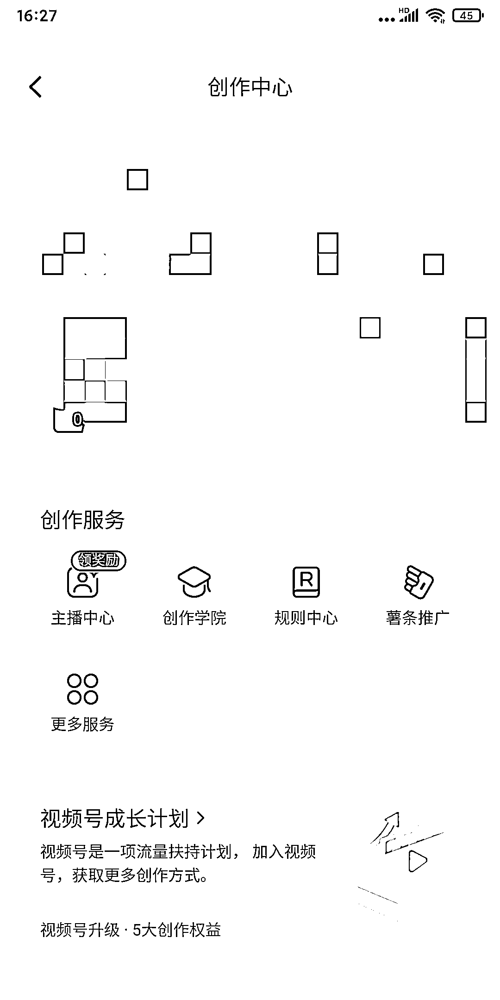
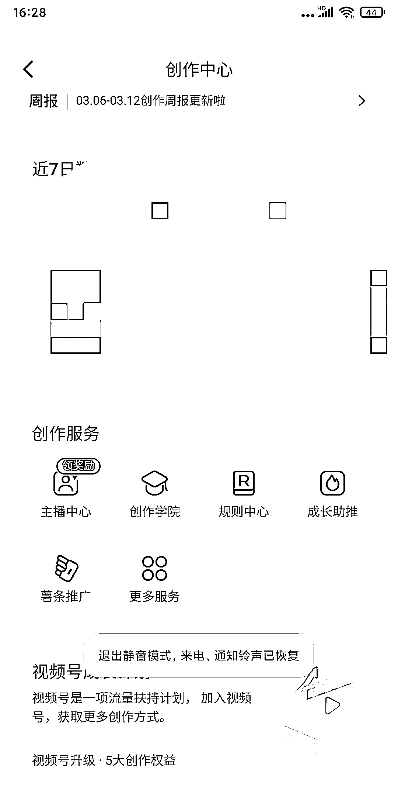

# 小红书新号如何找到 成长助推

> 原文：[`www.yuque.com/for_lazy/xkrm14/dzna6a778yevtt33`](https://www.yuque.com/for_lazy/xkrm14/dzna6a778yevtt33)

<ne-p id="u51c4632c" data-lake-id="u51c4632c"><ne-text id="u85250f47">作者： 小怪兽</ne-text></ne-p> <ne-p id="u0d7f3a06" data-lake-id="u0d7f3a06"><ne-text id="ud0a61dce">日期：2023-03-17</ne-text></ne-p> <ne-p id="u124a867f" data-lake-id="u124a867f"><ne-text id="u53408c42">点赞数：</ne-text><ne-text id="u08dc8603" ne-bold="true">50</ne-text></ne-p> <ne-hole id="uc8daa691" data-lake-id="uc8daa691"><ne-card data-card-name="hr" data-card-type="block" id="Zir7h" data-event-boundary="card"><ne-p id="u7db68555" data-lake-id="u7db68555"><ne-text id="u57369d46">正文：</ne-text></ne-p> <ne-p id="u44696660" data-lake-id="u44696660"><ne-text id="ud1f1d3b6">小红书如果新号没有 成长助推 怎么办（图 1） 不一定是废号，可以试试 1、打开小红书-》我的-》设置-》创作中心-》查看是否有成长助推（图 1）</ne-text> <ne-text id="u9ef3ca83">2、往下滑，找到创作灵感，右上角有一个订阅（图 2） 3、点击订阅（图 3） 4、成长助推出现了（图 4）</ne-text></ne-p> <ne-p id="u30a79f6c" data-lake-id="u30a79f6c"><ne-card data-card-name="image" data-card-type="inline" id="MLWlR" data-event-boundary="card"></ne-card></ne-p> <ne-p id="ucb6b056a" data-lake-id="ucb6b056a"><ne-card data-card-name="image" data-card-type="inline" id="GGItI" data-event-boundary="card"></ne-card></ne-p> <ne-p id="uaf3d3176" data-lake-id="uaf3d3176"><ne-card data-card-name="image" data-card-type="inline" id="Pfnzq" data-event-boundary="card"></ne-card></ne-p> <ne-p id="u06d2ae7d" data-lake-id="u06d2ae7d"><ne-card data-card-name="image" data-card-type="inline" id="yA2Pz" data-event-boundary="card"></ne-card></ne-p> <ne-hole id="ue84bf528" data-lake-id="ue84bf528"><ne-card data-card-name="hr" data-card-type="block" id="QKrbs" data-event-boundary="card"><ne-p id="u1d9dd0da" data-lake-id="u1d9dd0da"><ne-text id="u1e1dae62">评论区：</ne-text></ne-p> <ne-p id="u6bb24020" data-lake-id="u6bb24020"><ne-text id="u98b87213">暂无评论</ne-text></ne-p> <ne-hole id="uc6e6e11c" data-lake-id="uc6e6e11c"><ne-card data-card-name="hr" data-card-type="block" id="ZYVGP" data-event-boundary="card"><ne-p id="u0db3957c" data-lake-id="u0db3957c"><ne-text id="ub02ad47a">公众号懒人找资源，懒人专属群分享</ne-text></ne-p></ne-card></ne-hole></ne-card></ne-hole></ne-card></ne-hole>