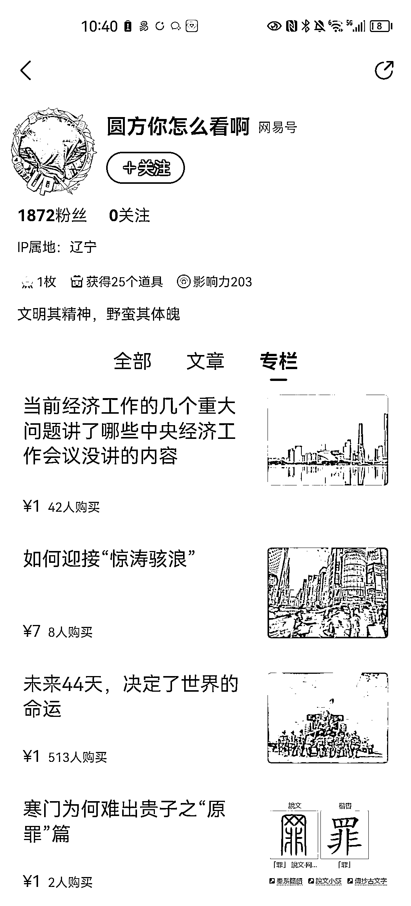

# 网易号，低粉付费文章，流量来源公众号

> 原文：[`www.yuque.com/for_lazy/xkrm14/hgba0ez22zkvln07`](https://www.yuque.com/for_lazy/xkrm14/hgba0ez22zkvln07)

作者： 王大诗

日期：2023-03-17

点赞数：34

正文：

网易号，低粉付费文章。一篇水文收 500 多块。感觉很适合参加公众号爆文航海的圈友们。

  <ne-p id="ue18070f9" data-lake-id="ue18070f9">评论区：

虚无的吴 : 他有一个公众号的，每天稳定几万阅读

茄子 : 他最开始被“政事堂 2019”作者顾子明推荐，开始写文章，在公众号有稳定的阅读群体，文章不水，每篇文章阅读过万，基本都有打赏，评论区也偶有精彩

公众号懒人找资源，懒人专属群分享

</ne-p>