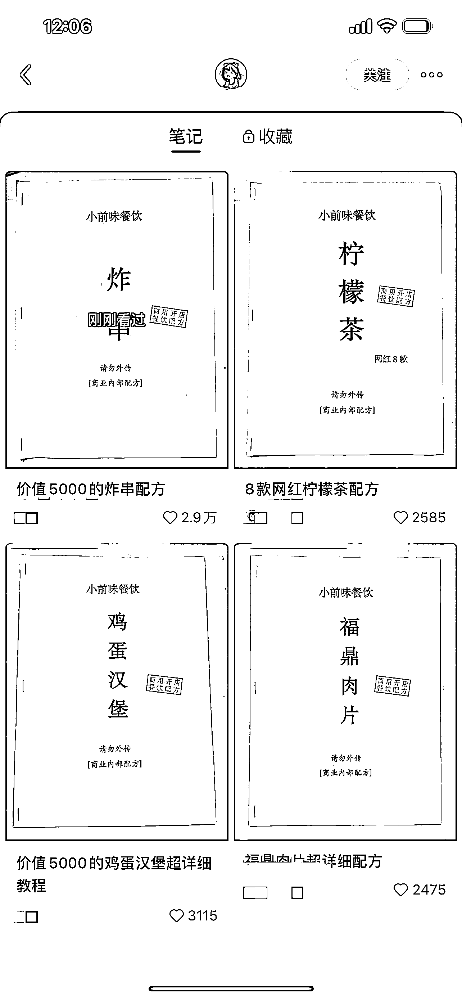

# 小红书发布小吃配方秘籍笔记，流量巨大，可引流私域

> 原文：[`www.yuque.com/for_lazy/xkrm14/ng1lys99t1hggk29`](https://www.yuque.com/for_lazy/xkrm14/ng1lys99t1hggk29)

作者： 明月几时有

日期：2023-03-17

点赞数：66

正文：

直接发布小吃配方流量巨大，作者一共发了四条，每一条都有 2000 以上的点赞，收藏超过点赞，可以直接模仿。

评论区：

小北 : 今天也刷到这个账号了

陆哲超 : 也刷到了好几个

lalalaLiz : 所有资料/教程/攻略都可以这样做，上回第一次看到这么搞的是个科目一的秘籍

LeoZ : 咋变现？

小鱼 : 估计是引流私域后续吧

豆豆 : 卖资料？

邓金山 : 我刚也刷到了，都上首页了，那个最新的那个图文已经十万赞了，太狠了

公众号懒人找资源，懒人专属群分享

