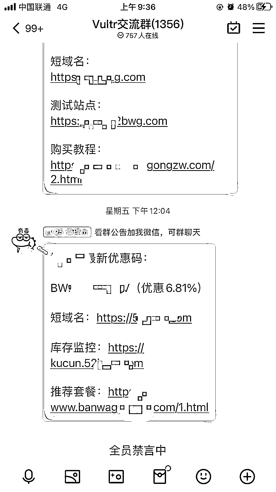

# 海外服务器 CPS ，在 Github 分享云服务器的实用教程

> 原文：[`www.yuque.com/for_lazy/xkrm14/xs7e1x788zfhm5r2`](https://www.yuque.com/for_lazy/xkrm14/xs7e1x788zfhm5r2)

作者： 海绵践行

日期：2023-03-16

点赞数：16

<ne-hole id="u942dfabb" data-lake-id="u942dfabb">

正文：

海外服务器 cps，在 github 分享云服务器的实用教程，然后可以跳转到自己的 cps 优惠购买链接，购买后获得佣金，留下以答疑交流群方式引流到 qq 群，微信群，流量精准，用户持续付费意愿强 可以参考 vultr 中文网，或者直接 github 开源项目的方式，好处是不用自己搭网站 在 chatGPT 等 Ai 工具这么热门的时候，做个卖水人也是不错的生意

<ne-hole id="uede7ee1b" data-lake-id="uede7ee1b">

评论区：

<ne-hole id="u28bce9d2" data-lake-id="u28bce9d2">

公众号懒人找资源，懒人专属群分享

</ne-hole></ne-hole></ne-hole>