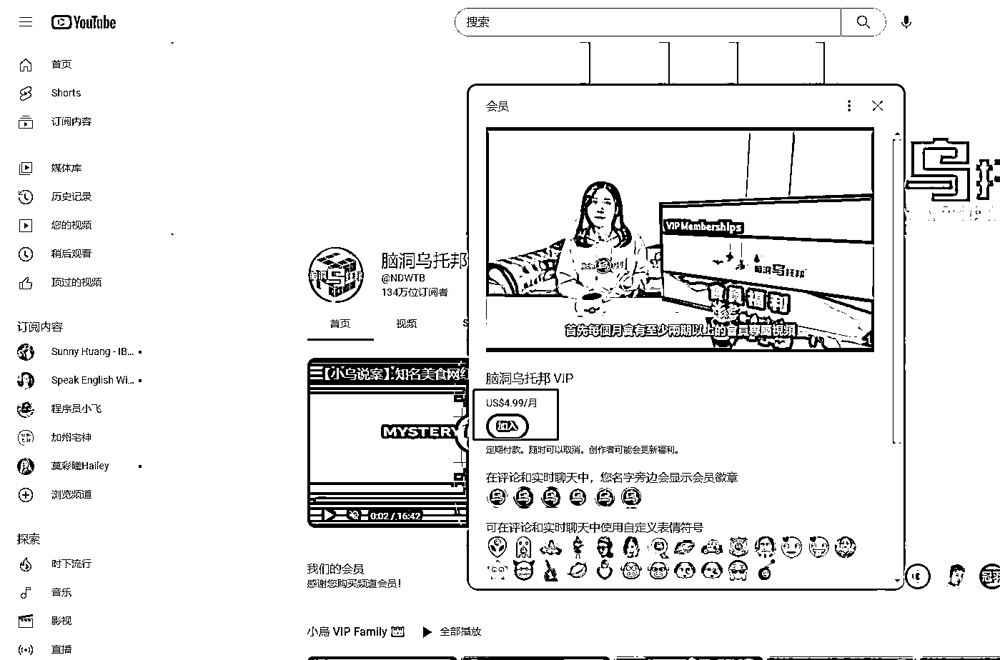
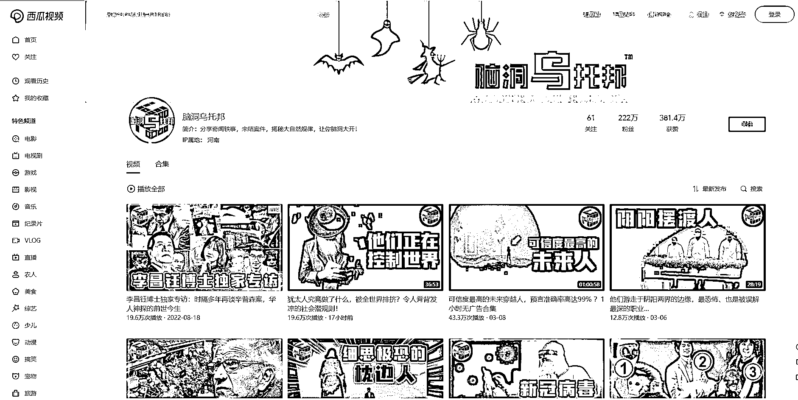

# 海外中文自媒体之会员盈利

> 原文：[`www.yuque.com/for_lazy/xkrm14/ulr1oo1ak4l1wixo`](https://www.yuque.com/for_lazy/xkrm14/ulr1oo1ak4l1wixo)

<ne-text id="u3dfdf7a5">作者： 米笠</ne-text>

<ne-text id="ud28b4e01">日期：2023-03-14</ne-text>

<ne-text id="u149d9417">点赞数：</ne-text><ne-text id="uaf7f1bb4" ne-bold="true">16</ne-text>

<ne-hole id="uf2bf45cf" data-lake-id="uf2bf45cf"><ne-card data-card-name="hr" data-card-type="block" id="YzMRN" data-event-boundary="card">

<ne-text id="u6ca78f99">正文：</ne-text>

<ne-text id="u1577e00b">海外中文自媒体之会员盈利 很多悬疑，历史类自媒体，不仅在国内平台受欢迎 在 youtube 上汉语悬疑、历史类内容浏览量也非常高 很多自媒体博主，都是多平台分发</ne-text> <ne-text id="u87b23fad">例如西瓜、B 站、youtube 等 除了赚流量分成 在 youtube 做这类内容，还有一个盈利方式就是会员订阅 订阅价格一般都是几美元每个月</ne-text> <ne-text id="u549498da">国外用户的付费意识要比国内用户强的多。 在媒体博主可以推出会员专享内容，赚取额外的会员订阅费。</ne-text>

<ne-card data-card-name="image" data-card-type="inline" id="MwhQg" data-event-boundary="card">  <ne-p id="ud429f3d4" data-lake-id="ud429f3d4"><ne-card data-card-name="image" data-card-type="inline" id="qTf4p" data-event-boundary="card">  <ne-p id="u14fd2d94" data-lake-id="u14fd2d94"><ne-card data-card-name="image" data-card-type="inline" id="anTnC" data-event-boundary="card">  <ne-hole id="u356280ee" data-lake-id="u356280ee"><ne-card data-card-name="hr" data-card-type="block" id="ccxlL" data-event-boundary="card"><ne-p id="u61c08149" data-lake-id="u61c08149"><ne-text id="uf56aae78">评论区：</ne-text>

<ne-hole id="u21f504bb" data-lake-id="u21f504bb"><ne-card data-card-name="hr" data-card-type="block" id="y7YOW" data-event-boundary="card">

<ne-text id="u3524b5b0">公众号懒人找资源，懒人专属群分享</ne-text>

</ne-card></ne-hole></ne-card></ne-hole></ne-card></ne-p></ne-card></ne-p></ne-card></ne-p></ne-card></ne-hole>