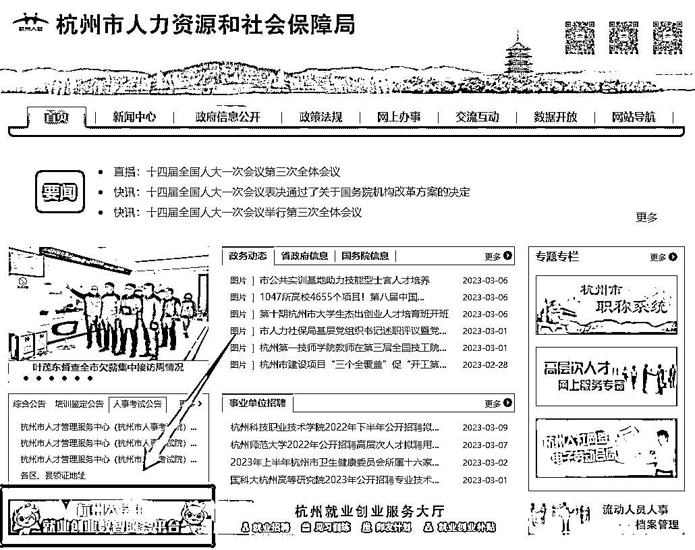

# 七十五、万元扶持资金！杭州市大学生杰出创业人才培育计划启动啦！

> 原文：[`www.yuque.com/for_lazy/xkrm14/hswi1qgx936gfygr`](https://www.yuque.com/for_lazy/xkrm14/hswi1qgx936gfygr)

作者： 少儿探索科学实验室

日期：2023-03-16

点赞数：12

正文：

75 万元扶持资金！杭州市大学生杰出创业人才培育计划启动啦！ 入选的培育对象，滨江区将在原 50 万培育扶持资金的基础上 加码 25 万 ，每人共计获得 75 万元 （65 万元为资助资金，10 万元为进行境外高端参访和培训的资金）。

  

评论区：

公众号懒人找资源，懒人专属群分享

</ne-p>