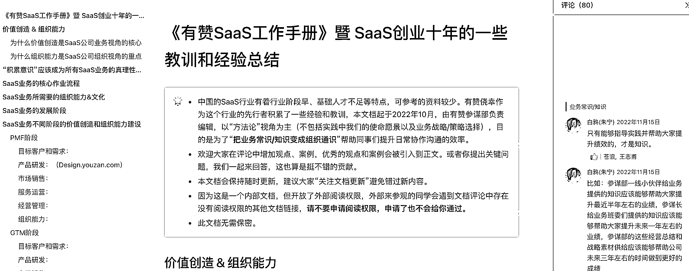

# 有赞把过去十年 SaaS 工作经验总结并分享出来

> 原文：[`www.yuque.com/for_lazy/xkrm14/lloutdno1grhrybm`](https://www.yuque.com/for_lazy/xkrm14/lloutdno1grhrybm)

作者： 果林

日期：2023-03-16

点赞数：22

<ne-hole id="u2f2eb21b" data-lake-id="u2f2eb21b"><ne-card data-card-name="hr" data-card-type="block" id="o5KyK" data-event-boundary="card">

正文：

有赞把过去十年 SaaS 工作经验总结并分享出来，干货十足！ [https://qima.feishu.cn/docs/doccnX2YXEjp4P9pvFtBgi...](https://qima.feishu.cn/docs/doccnX2YXEjp4P9pvFtBgiWBOpd#)

<ne-card data-card-name="image" data-card-type="inline" id="rElcD" data-event-boundary="card"></ne-card>

<ne-hole id="uee327186" data-lake-id="uee327186"><ne-card data-card-name="hr" data-card-type="block" id="F37sj" data-event-boundary="card">

评论区：

秋冬。 : 把这个喂给 gpt 咋样？

<ne-hole id="u3cce060d" data-lake-id="u3cce060d"><ne-card data-card-name="hr" data-card-type="block" id="ZuAI4" data-event-boundary="card">

公众号懒人找资源，懒人专属群分享

</ne-card></ne-hole></ne-card></ne-hole></ne-card></ne-hole>