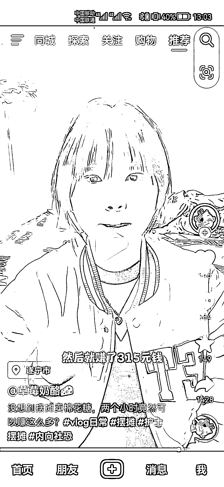

# 思路分享：小朋友多的地方摆摊，玩游戏实现销售变现

> 原文：[`www.yuque.com/for_lazy/xkrm14/egdf56lsq477dr2a`](https://www.yuque.com/for_lazy/xkrm14/egdf56lsq477dr2a)

<ne-p id="uade24be2" data-lake-id="uade24be2"><ne-text id="uef043b9f">作者： Leeka</ne-text></ne-p> <ne-p id="uda85b99e" data-lake-id="uda85b99e"><ne-text id="u632a12be">日期：2023-03-15</ne-text></ne-p> <ne-p id="ub8937fc9" data-lake-id="ub8937fc9"><ne-text id="u18da9f79">点赞数：</ne-text><ne-text id="u192ad5ae" ne-bold="true">66</ne-text></ne-p> <ne-hole id="ue19aa9bd" data-lake-id="ue19aa9bd"><ne-card data-card-name="hr" data-card-type="block" id="tZhQl" data-event-boundary="card"><ne-p id="ue0d79263" data-lake-id="ue0d79263"><ne-text id="u5207b11d">正文：</ne-text></ne-p> <ne-p id="uee070d95" data-lake-id="uee070d95"><ne-text id="u7edebb06">小朋友多的地方摆摊 剪刀石头布，客户赢了送棉花糖 1 支，客户输了，花原价 9 元买一支棉花糖 棉花糖成本价 1 元，博主 2 小时，卖了 35 支，送了 15 支，盈利 265</ne-text></ne-p> <ne-p id="uf92ef4a4" data-lake-id="uf92ef4a4"><ne-card data-card-name="image" data-card-type="inline" id="JwxsU" data-event-boundary="card"></ne-card></ne-p> <ne-p id="u13b9d6b5" data-lake-id="u13b9d6b5"><ne-card data-card-name="image" data-card-type="inline" id="e2737" data-event-boundary="card">  <ne-p id="u1d492260" data-lake-id="u1d492260"><ne-card data-card-name="image" data-card-type="inline" id="tWJmY" data-event-boundary="card">  <ne-hole id="u9445f989" data-lake-id="u9445f989"><ne-card data-card-name="hr" data-card-type="block" id="QSupk" data-event-boundary="card"><ne-p id="uc8a5b9fb" data-lake-id="uc8a5b9fb"><ne-text id="u3ce8d682">评论区：</ne-text></ne-p> <ne-p id="u049fb3bd" data-lake-id="u049fb3bd"><ne-text id="u171fe57e">闲米 : 形式不变，换个内容，👍🏻</ne-text></ne-p> <ne-hole id="udc04e488" data-lake-id="udc04e488"><ne-card data-card-name="hr" data-card-type="block" id="tO8c9" data-event-boundary="card"><ne-p id="uebcdbc2c" data-lake-id="uebcdbc2c"><ne-text id="uf878d25b">公众号懒人找资源，懒人专属群分享</ne-text></ne-p></ne-card></ne-hole></ne-card></ne-hole></ne-card></ne-p></ne-card></ne-p></ne-card></ne-hole>