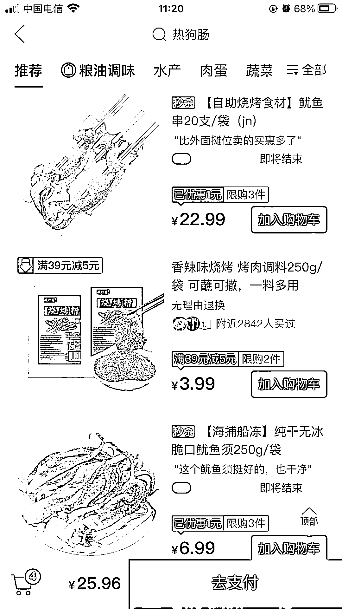

# 思路分享：可参考多多买菜、美团优选联盟等这些平台进行选品

> 原文：[`www.yuque.com/for_lazy/xkrm14/lnb0h6555v5g1y3g`](https://www.yuque.com/for_lazy/xkrm14/lnb0h6555v5g1y3g)

作者： 好六

日期：2023-03-15

点赞数：60

<ne-hole id="u19958155" data-lake-id="u19958155">

正文：

电商小白如果不擅长选品，可以参考下多多买菜、美团优选联盟等这些平台，这些平台商家的选品测品能力非常强，数据每天都能更新，而且更直观。比如最近视频号很火的枣饼，其实最近在多多买菜已经爆过了。

<ne-hole id="ua42d5c06" data-lake-id="ua42d5c06">

评论区：

薇姐买房 : 这个思路真不错

瑞峰 : 我咋感觉这个是因为千人千面的因素呢，平台根据你输入法的缓存抓取到你的喜好，然后给你推荐的

Luke 王子 : 感谢分享

<ne-hole id="u7a735914" data-lake-id="u7a735914">

公众号懒人找资源，懒人专属群分享

</ne-hole></ne-hole></ne-hole>