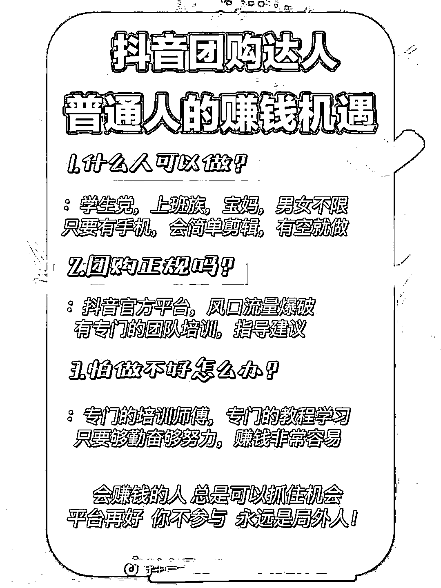

# 商业认知：情感类目以免费培训的方式发展代理、下线、团长

> 原文：[`www.yuque.com/for_lazy/xkrm14/vv2tf354dorysak4`](https://www.yuque.com/for_lazy/xkrm14/vv2tf354dorysak4)

作者： 乐飞教主

日期：2023-03-15

点赞数：22

正文：

以免费培训的方式发展代理、下线、团长？ 一个朋友做情感咨询，公司 10 来个人 8 个咨询师（销售）。只针对女性用户，咨询免费，服务费按月算，客单价大几 K 到几个 W 不等。主营情感破裂、挽回、小三、出轨等。 做了几期免费培训咨询师业务，周期一个月，要求必须到线下公司来。不包吃住，满一个月周期每天 100 块生活补助。对外宣称合伙人。主要是 boss 招聘、抖音、知乎平台引流，到私域再筛选，重点是能来线下的。到线下培训期间整个过程都在做筛选。业务熟练、有销售能力、有结果的优质人才留在公司实习一段时间，就是不断洗脑，然后外放出去办分公司。这边提供流量、售后服务，那边只负责销售。一单抽 30%左右。每期人才留存率在 20%左右。 就这样办了几期，分公司开出去近十家，收入大幅度增长。总公司还留存些销售人才。 项目 0-1 跑成功想 1-100 努力的可以参考。 核心是要么把握住流量，转化和产品放手。要么把握住产品，流量和转化放手。 例如，做团长，培训他怎么引流、转化。自己做产品、文案。自有货源更佳。 知识付费同上，做好服务、售后、交付。引流与转化让他做，分拥。 一些引流到私域没有参加培训的后期可转化其它知识付费类产品或者卖粉。 小白就先去项目库挑个感兴趣的项目，按操作顺序从 0-1 跑出结果，直接抖音直播免费带徒弟，引流到私域发你跑出结果的项目资料给对方，带他一起跑并把他发展成你的下线。

  

  

  

  

评论区：

公众号懒人找资源，懒人专属群分享

