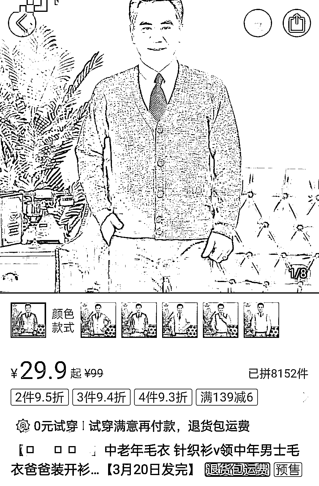

# 中老年服装也能成为 jk 少女热爱的爆品

> 原文：[`www.yuque.com/for_lazy/xkrm14/gep3btfzmf3nhpcv`](https://www.yuque.com/for_lazy/xkrm14/gep3btfzmf3nhpcv)

作者： 波本零

日期：2023-03-15

点赞数：11

<ne-hole id="u9dfea382" data-lake-id="u9dfea382">

正文：

中老年服装也能成为 jk 少女热爱的爆品 V 领设计，可能是为了展示爸爸们打拼半辈子赚下的象征身份的领带。但也许更方便露出 JK 们花样繁多的水手领结。直筒版型，也许是为了遮住叔叔们人到中年逃不开的肚腩，但免不了让人联想到衣着宽松的学生时代。更重要的是，没了 JK 制服滤镜，老头衫在价格上具有无可比拟的优势，性价比超出 JK 开衫一大截。 所以产品做差异化，比如 a 品原本只能用在群体 a 或者场景 a 上，但那可能意味着在 a 市场会很卷。如果把 a 用在 b 或者 cde 上，就可以成为新的蓝海产品。

  <ne-hole id="u631f6585" data-lake-id="u631f6585"><ne-p id="u2e7d9987" data-lake-id="u2e7d9987">评论区：

张永胜📷 : 还可以这样

<ne-hole id="ub6542bae" data-lake-id="ub6542bae">

公众号懒人找资源，懒人专属群分享

</ne-hole></ne-hole></ne-p></ne-hole>